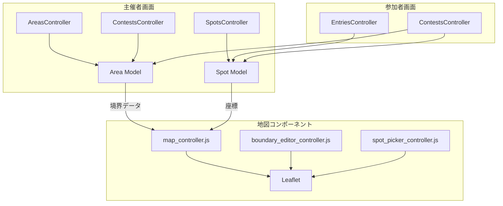

# Design Document: Area Management (地域指定機能)

## Overview

商店街単位でのフォトコンテストを支援する地域指定機能の設計。主催者がエリア（地域）を定義し、コンテストごとに撮影スポットを登録できる。Leaflet + OpenStreetMap による地図表示で、エリア境界線やスポットマーカーを視覚的に表現する。

本機能は以下の3つの主要コンポーネントで構成される：
1. **エリア管理**: 主催者が地域を定義・管理
2. **スポット管理**: コンテストごとに撮影ポイントを登録
3. **地図表示**: Leaflet による境界線・マーカー表示

## Steering Document Alignment

### Technical Standards (tech.md)

- **Ruby on Rails 7.1**: 標準的な MVC アーキテクチャに従う
- **Hotwire (Turbo + Stimulus)**: 地図操作は Stimulus コントローラーで実装
- **Active Storage**: エリアのカバー画像に使用（将来拡張）
- **地図 API**: tech.md 記載の OpenStreetMap を採用（Leaflet ライブラリ）

### Project Structure (structure.md)

- **Controllers**: `Organizers::AreasController`, `Organizers::SpotsController`
- **Models**: `Area`（拡張）, `Spot`（新規）
- **Views**: `app/views/organizers/areas/`, `app/views/organizers/spots/`
- **JavaScript**: `app/javascript/controllers/map_controller.js` 等
- **名前空間**: 主催者向け機能は `Organizers::` 名前空間に配置

## Code Reuse Analysis

### Existing Components to Leverage

- **Area モデル**: 既存の基本構造を拡張（住所・座標カラム追加）
- **Entry モデル**: 既に area_id を持つため、spot_id を追加するのみ
- **Organizers::BaseController**: 認証・認可の共通処理を継承
- **フォームスタイル**: 既存の contests/evaluation_criteria フォームのスタイルを踏襲
- **flash_controller.js**: 通知表示に再利用

### Integration Points

- **Contest モデル**: area_id カラムを追加しエリアと紐付け
- **Entry モデル**: spot_id カラムを追加しスポットと紐付け
- **routes.rb**: organizers 名前空間に areas, spots リソースを追加

## Architecture



### Modular Design Principles

- **Single File Responsibility**: 地図操作は専用の Stimulus コントローラーに分離
- **Component Isolation**: 境界線編集、スポットピッカー、地図表示を個別コントローラーに
- **Service Layer Separation**: 座標変換・GeoJSON処理はヘルパーに切り出し
- **Utility Modularity**: Leaflet 初期化・タイル設定は共通ユーティリティとして提供

## Components and Interfaces

### Area Model（拡張）

- **Purpose**: 地域（エリア）の定義と管理
- **Interfaces**:
  - `full_address` - 完全な住所文字列を返す
  - `has_boundary?` - 境界線が設定されているか
  - `boundary_polygon` - GeoJSON をパースしてポリゴンデータを返す
  - `center_coordinates` - 代表座標を [lat, lng] で返す
- **Dependencies**: User（所有者）
- **Reuses**: 既存の Area 基本構造

### Spot Model（新規）

- **Purpose**: コンテスト内の撮影スポット管理
- **Interfaces**:
  - `coordinates` - [lat, lng] 形式で座標を返す
  - `category_name` - カテゴリの日本語名を返す
- **Dependencies**: Contest
- **Reuses**: なし（新規作成）

### Organizers::AreasController

- **Purpose**: 主催者向けエリア CRUD
- **Interfaces**: index, show, new, create, edit, update, destroy
- **Dependencies**: Area, current_user
- **Reuses**: Organizers::BaseController

### Organizers::SpotsController

- **Purpose**: コンテスト内スポット CRUD
- **Interfaces**: index, new, create, edit, update, destroy, update_positions
- **Dependencies**: Spot, Contest, current_user
- **Reuses**: Organizers::BaseController

### MapController (Stimulus)

- **Purpose**: 地図の基本表示と操作
- **Interfaces**:
  - `connect()` - 地図を初期化
  - `setCenter(lat, lng, zoom)` - 中心座標を設定
  - `addMarker(lat, lng, options)` - マーカーを追加
  - `addPolygon(geojson)` - ポリゴンを描画
- **Dependencies**: Leaflet
- **Reuses**: なし（新規作成）

### BoundaryEditorController (Stimulus)

- **Purpose**: 境界線の描画・編集
- **Interfaces**:
  - `startDrawing()` - 描画モード開始
  - `cancelDrawing()` - 描画キャンセル
  - `savePolygon()` - GeoJSON として保存
  - `clearPolygon()` - 境界線をクリア
- **Dependencies**: MapController, Leaflet.draw
- **Reuses**: MapController

### SpotPickerController (Stimulus)

- **Purpose**: スポット選択（投稿時）
- **Interfaces**:
  - `selectSpot(spotId)` - スポットを選択
  - `highlightSpot(spotId)` - スポットをハイライト
- **Dependencies**: MapController
- **Reuses**: MapController

## Data Models

### Area（拡張）

```ruby
# db/migrate/xxxx_expand_areas.rb
class ExpandAreas < ActiveRecord::Migration[8.0]
  def change
    add_column :areas, :user_id, :integer, null: false
    add_column :areas, :prefecture, :string, limit: 20
    add_column :areas, :city, :string, limit: 50
    add_column :areas, :address, :string, limit: 200
    add_column :areas, :latitude, :decimal, precision: 10, scale: 7
    add_column :areas, :longitude, :decimal, precision: 10, scale: 7
    add_column :areas, :boundary_geojson, :text
    add_column :areas, :description, :text

    add_index :areas, :user_id
    add_foreign_key :areas, :users
  end
end
```

### Spot（新規）

```ruby
# db/migrate/xxxx_create_spots.rb
class CreateSpots < ActiveRecord::Migration[8.0]
  def change
    create_table :spots do |t|
      t.references :contest, null: false, foreign_key: true
      t.string :name, limit: 100, null: false
      t.integer :category, default: 0, null: false
      t.string :address, limit: 200
      t.decimal :latitude, precision: 10, scale: 7
      t.decimal :longitude, precision: 10, scale: 7
      t.text :description
      t.integer :position, default: 0

      t.timestamps
    end

    add_index :spots, [:contest_id, :position]
    add_index :spots, [:contest_id, :name], unique: true
  end
end
```

### Contest（拡張）

```ruby
# db/migrate/xxxx_add_area_to_contests.rb
class AddAreaToContests < ActiveRecord::Migration[8.0]
  def change
    add_reference :contests, :area, foreign_key: true
    add_column :contests, :require_spot, :boolean, default: false
  end
end
```

### Entry（拡張）

```ruby
# db/migrate/xxxx_add_spot_to_entries.rb
class AddSpotToEntries < ActiveRecord::Migration[8.0]
  def change
    add_reference :entries, :spot, foreign_key: true
    add_column :entries, :latitude, :decimal, precision: 10, scale: 7
    add_column :entries, :longitude, :decimal, precision: 10, scale: 7
    add_column :entries, :location_source, :integer, default: 0
  end
end
```

### Enum 定義

```ruby
# app/models/spot.rb
class Spot < ApplicationRecord
  enum :category, {
    restaurant: 0,      # 飲食店
    retail: 1,          # 小売店
    service: 2,         # サービス業
    landmark: 3,        # 名所・ランドマーク
    public_facility: 4, # 公共施設
    park: 5,            # 公園・広場
    temple_shrine: 6,   # 寺社仏閣
    other: 99           # その他
  }
end

# app/models/entry.rb（追加）
class Entry < ApplicationRecord
  enum :location_source, {
    manual: 0,    # 手動選択
    exif: 1,      # EXIF から取得
    gps: 2        # ブラウザ GPS
  }, prefix: :location
end
```

## Error Handling

### Error Scenarios

1. **エリア削除時にコンテストが紐づいている**
   - **Handling**: 削除を拒否し、エラーメッセージを表示
   - **User Impact**: 「このエリアはコンテストで使用中のため削除できません」と表示

2. **スポット削除時に投稿が紐づいている**
   - **Handling**: 確認ダイアログを表示し、承諾時は spot_id を null に設定
   - **User Impact**: 「このスポットは投稿で使用中です。削除すると投稿のスポット情報がクリアされます。」と確認

3. **境界線 GeoJSON が不正**
   - **Handling**: バリデーションでフォーマットチェック、不正な場合は保存拒否
   - **User Impact**: 「境界線データが不正です。再度描画してください」と表示

4. **地図タイル読み込み失敗**
   - **Handling**: エラーをキャッチし、代替メッセージを表示
   - **User Impact**: 「地図を読み込めませんでした。住所情報を確認してください」と表示

5. **座標取得失敗（住所から）**
   - **Handling**: 手動入力フォームを表示
   - **User Impact**: 「住所から座標を取得できませんでした。地図上で位置を指定してください」と表示

## File Structure

```
app/
├── controllers/
│   └── organizers/
│       ├── areas_controller.rb        # エリア CRUD
│       └── spots_controller.rb        # スポット CRUD
├── models/
│   ├── area.rb                        # 拡張
│   ├── spot.rb                        # 新規
│   ├── contest.rb                     # area 関連追加
│   └── entry.rb                       # spot 関連追加
├── views/
│   └── organizers/
│       ├── areas/
│       │   ├── index.html.erb
│       │   ├── show.html.erb
│       │   ├── new.html.erb
│       │   ├── edit.html.erb
│       │   └── _form.html.erb
│       └── spots/
│           ├── index.html.erb
│           ├── new.html.erb
│           ├── edit.html.erb
│           └── _form.html.erb
├── javascript/
│   └── controllers/
│       ├── map_controller.js          # 基本地図操作
│       ├── boundary_editor_controller.js  # 境界線編集
│       └── spot_picker_controller.js  # スポット選択
└── helpers/
    └── map_helper.rb                  # 地図関連ヘルパー

config/
├── routes.rb                          # ルート追加
└── importmap.rb                       # Leaflet 追加

db/
└── migrate/
    ├── xxxx_expand_areas.rb
    ├── xxxx_create_spots.rb
    ├── xxxx_add_area_to_contests.rb
    └── xxxx_add_spot_to_entries.rb

spec/
├── models/
│   ├── area_spec.rb
│   └── spot_spec.rb
├── requests/
│   └── organizers/
│       ├── areas_spec.rb
│       └── spots_spec.rb
└── system/
    └── organizers/
        ├── area_management_spec.rb
        └── spot_management_spec.rb
```

## Testing Strategy

### Unit Testing

- **Area モデル**: バリデーション、スコープ、full_address、has_boundary? 等
- **Spot モデル**: バリデーション、category enum、coordinates 等
- **GeoJSON パース**: 正常ケース、異常ケースのテスト

### Integration Testing (Request Specs)

- **AreasController**: CRUD 操作、認可チェック、エラーハンドリング
- **SpotsController**: CRUD 操作、コンテスト所有者チェック、位置更新
- **ContestsController**: エリア選択、スポット必須設定

### End-to-End Testing (System Specs)

- **エリア作成フロー**: フォーム入力 → 地図で位置指定 → 保存
- **スポット管理フロー**: 追加 → 編集 → 並び替え → 削除
- **投稿時スポット選択**: 地図でスポット確認 → 選択 → 投稿

### JavaScript Testing

- **map_controller.js**: Leaflet 初期化、マーカー追加、ポリゴン描画
- **boundary_editor_controller.js**: 描画開始/終了、GeoJSON 出力
- **spot_picker_controller.js**: スポット選択、ハイライト

## Implementation Phases

### Phase 1: データ基盤（エリア拡張・スポット作成）
- DB マイグレーション
- モデル実装・テスト
- Factory 定義

### Phase 2: 主催者向けエリア管理
- AreasController CRUD
- エリア管理ビュー
- 基本地図表示（Stimulus）

### Phase 3: 主催者向けスポット管理
- SpotsController CRUD
- スポット管理ビュー
- 地図上でのスポット追加

### Phase 4: コンテスト連携
- Contest にエリア選択追加
- コンテスト詳細でのエリア・スポット表示

### Phase 5: 投稿連携
- Entry にスポット選択追加
- 投稿フォームでのスポット選択 UI

### Phase 6: 地図表示（参加者向け）
- コンテスト詳細の地図表示
- 投稿一覧のマップモード
