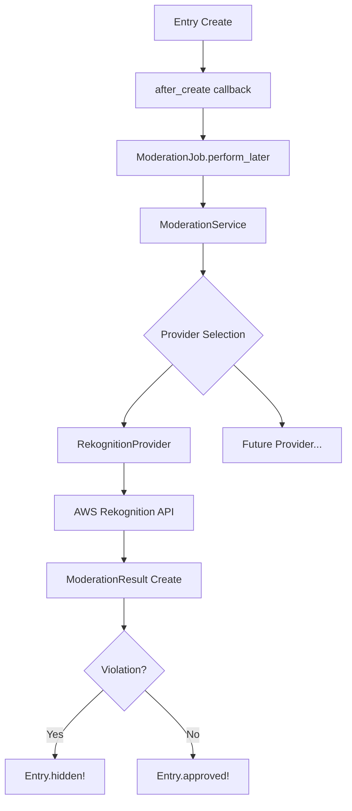

# Design Document: Content Moderation

## Overview

投稿写真の自動コンテンツモデレーション機能の技術設計。AWS Rekognitionを初期プロバイダーとして、投稿時に非同期で画像判定を行い、違反コンテンツを自動非表示にする。Strategy Patternによるプロバイダー抽象化で将来の拡張に対応。

## Steering Document Alignment

### Technical Standards (tech.md)

- **Ruby on Rails 7.1 + Hotwire**: 既存アーキテクチャに準拠
- **Active Job**: バックグラウンドジョブによる非同期処理
- **Active Storage統合**: 画像ファイルへの直接アクセス
- **Rails credentials**: AWS認証情報の安全な管理
- **RSpec**: 単体・統合テストによる品質保証

### Project Structure (structure.md)

- **サービス層**: `app/services/moderation/` に新規サービス配置
- **ジョブ**: `app/jobs/` にモデレーションジョブ配置
- **コントローラー**: `Organizers::` 名前空間でモデレーション管理
- **命名規約**: snake_case（ファイル）、PascalCase（クラス）に準拠

## Code Reuse Analysis

### Existing Components to Leverage

- **Entry model**: モデレーション対象、`has_one_attached :photo`
- **ApplicationJob**: ジョブ基底クラス
- **Notification model**: モデレーション結果通知（将来拡張）
- **Organizers namespace**: 主催者向けコントローラーパターン

### Integration Points

- **Active Storage**: `entry.photo.blob` から画像バイナリ取得
- **Entry lifecycle**: `after_create` コールバックでジョブキュー
- **Contest settings**: モデレーション有効/無効設定

## Architecture

Strategy Patternによるプロバイダー抽象化と、Active Jobによる非同期処理を組み合わせた設計。

### Modular Design Principles

- **Single File Responsibility**: プロバイダー、サービス、ジョブを分離
- **Component Isolation**: 各プロバイダーは独立して動作
- **Service Layer Separation**: モデレーションロジックをサービス層に集約
- **Utility Modularity**: 共通処理は基底クラスに抽出



## Components and Interfaces

### Component 1: ModerationService

- **Purpose**: モデレーション判定の統括、プロバイダー選択、結果処理
- **Interfaces**:
  - `ModerationService.moderate(entry)` - エントリーのモデレーション実行
  - `ModerationService.provider` - 現在のプロバイダー取得
- **Dependencies**: Entry, ModerationResult, Provider classes
- **Reuses**: Rails configuration pattern

```ruby
# app/services/moderation/moderation_service.rb
module Moderation
  class ModerationService
    def self.moderate(entry)
      new(entry).moderate
    end

    def initialize(entry)
      @entry = entry
    end

    def moderate
      return skip_result if skip_moderation?

      result = provider.analyze(@entry.photo)
      save_result(result)
      apply_action(result)
    end

    private

    def provider
      @provider ||= Moderation::Providers.current
    end
  end
end
```

### Component 2: BaseProvider (Abstract)

- **Purpose**: プロバイダー共通インターフェースの定義
- **Interfaces**:
  - `#analyze(attachment)` - 画像分析実行（abstract）
  - `#name` - プロバイダー名
- **Dependencies**: なし（抽象基底クラス）
- **Reuses**: なし

```ruby
# app/services/moderation/providers/base_provider.rb
module Moderation
  module Providers
    class BaseProvider
      def analyze(attachment)
        raise NotImplementedError
      end

      def name
        self.class.name.demodulize.underscore
      end
    end
  end
end
```

### Component 3: RekognitionProvider

- **Purpose**: AWS Rekognition DetectModerationLabelsの実装
- **Interfaces**:
  - `#analyze(attachment)` - Rekognition APIによる分析
- **Dependencies**: aws-sdk-rekognition gem, Active Storage
- **Reuses**: BaseProvider

```ruby
# app/services/moderation/providers/rekognition_provider.rb
module Moderation
  module Providers
    class RekognitionProvider < BaseProvider
      MODERATION_LABELS = %w[
        Explicit_Nudity
        Suggestive
        Violence
        Visually_Disturbing
        Hate_Symbols
      ].freeze

      def analyze(attachment)
        response = client.detect_moderation_labels(
          image: { bytes: attachment.download },
          min_confidence: threshold
        )

        build_result(response)
      end

      private

      def client
        @client ||= Aws::Rekognition::Client.new
      end

      def threshold
        Rails.application.config.moderation.threshold || 60.0
      end

      def build_result(response)
        # ModerationResult compatible hash
      end
    end
  end
end
```

### Component 4: ModerationJob

- **Purpose**: 非同期モデレーション実行
- **Interfaces**:
  - `ModerationJob.perform_later(entry_id)` - ジョブキュー登録
- **Dependencies**: ModerationService, Entry
- **Reuses**: ApplicationJob

```ruby
# app/jobs/moderation_job.rb
class ModerationJob < ApplicationJob
  queue_as :moderation
  retry_on StandardError, wait: :polynomially_longer, attempts: 3

  discard_on ActiveJob::DeserializationError

  def perform(entry_id)
    entry = Entry.find_by(id: entry_id)
    return unless entry&.photo&.attached?

    Moderation::ModerationService.moderate(entry)
  end
end
```

### Component 5: ModerationResultsController

- **Purpose**: 主催者向けモデレーション管理UI
- **Interfaces**:
  - `GET /organizers/contests/:contest_id/moderation` - 一覧
  - `PATCH /organizers/contests/:contest_id/entries/:id/approve` - 承認
  - `PATCH /organizers/contests/:contest_id/entries/:id/reject` - 却下
- **Dependencies**: Entry, ModerationResult, Contest
- **Reuses**: Organizers::BaseController

## Data Models

### Model 1: ModerationResult

エントリーごとのモデレーション判定結果を記録。

```ruby
# Table: moderation_results
- id: bigint (primary key)
- entry_id: bigint (foreign key, unique)
- provider: string (e.g., "rekognition")
- status: integer (enum: pending, approved, rejected, requires_review)
- labels: jsonb (検出されたラベル配列)
- max_confidence: decimal (最大信頼度スコア)
- raw_response: jsonb (APIレスポンス全体、デバッグ用)
- reviewed_by_id: bigint (foreign key to users, nullable)
- reviewed_at: datetime
- review_note: text
- created_at: datetime
- updated_at: datetime

# Indexes
- index_moderation_results_on_entry_id (unique)
- index_moderation_results_on_status
- index_moderation_results_on_reviewed_by_id
```

### Model 2: Entry (拡張)

既存Entryモデルにモデレーション関連フィールドを追加。

```ruby
# Table: entries (新規カラム)
- moderation_status: integer (enum: pending, approved, hidden, requires_review)
  # default: pending

# New association
has_one :moderation_result, dependent: :destroy
```

### Model 3: Contest (拡張)

コンテスト単位のモデレーション設定。

```ruby
# Table: contests (新規カラム)
- moderation_enabled: boolean (default: true)
- moderation_threshold: decimal (default: 60.0)
```

## Error Handling

### Error Scenarios

1. **AWS Rekognition API エラー**
   - **Handling**: リトライ（指数バックオフ、最大3回）、失敗時は`requires_review`ステータス
   - **User Impact**: 投稿は完了するが、手動レビュー待ち状態になる

2. **画像取得エラー（Active Storage）**
   - **Handling**: ジョブ破棄（discard_on）、エラーログ記録
   - **User Impact**: モデレーションスキップ、手動レビュー必要

3. **AWS認証エラー**
   - **Handling**: 即座に失敗、管理者アラート
   - **User Impact**: 全エントリーが手動レビュー待ち

4. **タイムアウト（30秒超過）**
   - **Handling**: リトライ、最終的に`requires_review`
   - **User Impact**: 投稿は完了、判定遅延

### Error Recovery

```ruby
# ModerationJob
retry_on Aws::Rekognition::Errors::ServiceError,
         wait: :polynomially_longer,
         attempts: 3

rescue_from StandardError do |exception|
  entry = Entry.find_by(id: arguments.first)
  entry&.update!(moderation_status: :requires_review)
  Rails.logger.error("Moderation failed: #{exception.message}")
end
```

## Testing Strategy

### Unit Testing

- **ModerationService**: モック化したプロバイダーでの判定ロジック
- **RekognitionProvider**: AWS SDKモックでのレスポンス処理
- **ModerationResult model**: バリデーション、スコープ、enum
- **Entry model拡張**: モデレーションステータス遷移

```ruby
# spec/services/moderation/moderation_service_spec.rb
RSpec.describe Moderation::ModerationService do
  let(:entry) { create(:entry) }

  describe ".moderate" do
    context "when violation detected" do
      before do
        allow_any_instance_of(Moderation::Providers::RekognitionProvider)
          .to receive(:analyze).and_return(violation_result)
      end

      it "sets entry status to hidden" do
        described_class.moderate(entry)
        expect(entry.reload.moderation_status).to eq("hidden")
      end
    end
  end
end
```

### Integration Testing

- **ModerationJob**: ジョブ実行→サービス呼び出し→結果保存フロー
- **Entry作成フロー**: エントリー作成→ジョブキュー→ステータス更新
- **コントローラー**: 承認/却下アクションの権限・結果

```ruby
# spec/jobs/moderation_job_spec.rb
RSpec.describe ModerationJob do
  include ActiveJob::TestHelper

  let(:entry) { create(:entry) }

  it "queues moderation on entry create" do
    expect {
      entry
    }.to have_enqueued_job(ModerationJob).with(entry.id)
  end
end
```

### End-to-End Testing

- **投稿→モデレーション→表示フロー**: 正常系E2E
- **違反検出→非表示→レビュー→承認**: 管理者レビューフロー
- **モデレーション無効コンテスト**: スキップ確認

```ruby
# spec/system/organizers/moderation_spec.rb
RSpec.describe "Moderation Review", type: :system do
  let(:organizer) { create(:user, :organizer) }
  let(:contest) { create(:contest, user: organizer) }
  let(:entry) { create(:entry, contest: contest, moderation_status: :requires_review) }

  it "allows organizer to approve hidden entry" do
    login_as(organizer)
    visit organizers_contest_moderation_path(contest)

    within("#entry_#{entry.id}") do
      click_button "承認"
    end

    expect(entry.reload.moderation_status).to eq("approved")
  end
end
```

## Configuration

### Rails Configuration

```ruby
# config/initializers/moderation.rb
Rails.application.configure do
  config.moderation = ActiveSupport::OrderedOptions.new
  config.moderation.provider = ENV.fetch("MODERATION_PROVIDER", "rekognition")
  config.moderation.threshold = ENV.fetch("MODERATION_THRESHOLD", 60.0).to_f
  config.moderation.enabled = ENV.fetch("MODERATION_ENABLED", "true") == "true"
end
```

### AWS Credentials

```yaml
# config/credentials.yml.enc
aws:
  access_key_id: xxx
  secret_access_key: xxx
  region: ap-northeast-1
```

### Gemfile

```ruby
# Gemfile
gem "aws-sdk-rekognition", "~> 1.0"
```

## File Structure

```
app/
├── services/
│   └── moderation/
│       ├── moderation_service.rb
│       └── providers/
│           ├── base_provider.rb
│           ├── rekognition_provider.rb
│           └── providers.rb  # Factory/registry
├── jobs/
│   └── moderation_job.rb
├── models/
│   └── moderation_result.rb
├── controllers/
│   └── organizers/
│       └── moderation_controller.rb
└── views/
    └── organizers/
        └── moderation/
            ├── index.html.erb
            └── _entry.html.erb

config/
└── initializers/
    └── moderation.rb

db/
└── migrate/
    ├── xxx_create_moderation_results.rb
    ├── xxx_add_moderation_status_to_entries.rb
    └── xxx_add_moderation_settings_to_contests.rb
```
