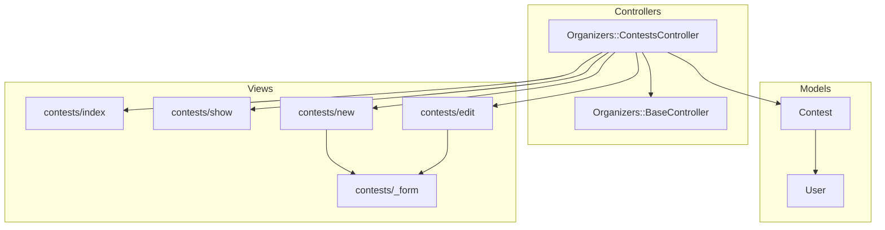
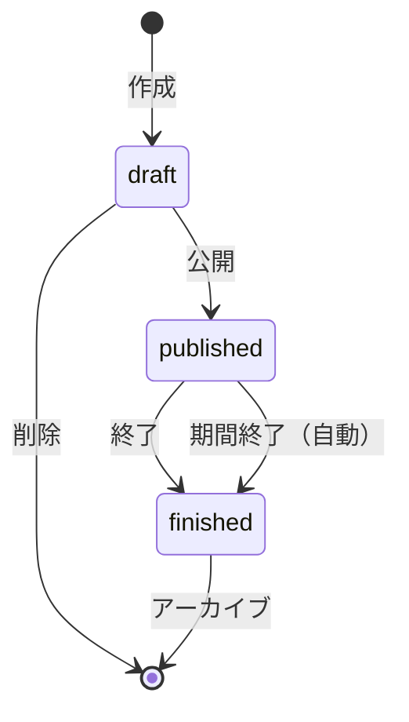

# Design Document

## Overview

コンテスト作成・管理機能は、運営者がフォトコンテストのライフサイクルを管理するための機能を提供する。Contest モデルを中心に、RESTful な CRUD 操作と状態遷移管理を実装する。

## Steering Document Alignment

### Technical Standards (tech.md)
- Ruby on Rails 7.1 の MVC アーキテクチャに従う
- Hotwire (Turbo + Stimulus) を活用したインタラクティブ UI
- Active Storage による画像管理
- RSpec によるテスト駆動開発

### Project Structure (structure.md)
- コントローラー: `app/controllers/organizers/contests_controller.rb`
- モデル: `app/models/contest.rb`
- ビュー: `app/views/organizers/contests/`
- テスト: `spec/models/contest_spec.rb`, `spec/requests/organizers/contests_spec.rb`

## Code Reuse Analysis

### Existing Components to Leverage
- **Organizers::BaseController**: 認証・権限・利用規約チェックを継承
- **User モデル**: コンテスト所有者として関連付け（belongs_to :user）
- **shared/_flash.html.erb**: フラッシュメッセージ表示
- **shared/_header.html.erb, _sidebar.html.erb, _footer.html.erb**: レイアウトコンポーネント
- **Tailwind CSS**: 既存のデザインシステム

### Integration Points
- **Routes**: `namespace :organizers` 内に `resources :contests` を追加
- **Dashboard**: ダッシュボードからコンテスト一覧へのリンク
- **User 関連**: `has_many :contests` を User モデルに追加

## Architecture

### 全体構成



### ステータス遷移図



### Modular Design Principles
- **Single File Responsibility**: Contest モデルはコンテスト情報のみ管理
- **Component Isolation**: フォームは _form パーシャルに分離
- **Service Layer Separation**: 複雑なビジネスロジックは将来的に Service に分離可能
- **Utility Modularity**: ステータス管理ロジックは Contest モデル内の concern に切り出し可能

## Components and Interfaces

### Contest Model
- **Purpose:** コンテストの基本情報とステータスを管理
- **Interfaces:**
  - `#draft?`, `#published?`, `#finished?` - ステータス確認
  - `#publish!` - 下書きから公開への状態遷移
  - `#finish!` - 公開から終了への状態遷移
  - `#soft_delete!` - 論理削除
  - `#accepting_entries?` - 応募受付中かどうか
  - `.active` - 削除されていないコンテスト
  - `.by_status(status)` - ステータスでフィルタ
- **Dependencies:** ApplicationRecord, User
- **Reuses:** Rails enum, ActiveRecord スコープ

### Organizers::ContestsController
- **Purpose:** コンテストの CRUD 操作を提供
- **Interfaces:**
  - `GET /organizers/contests` - 一覧表示
  - `GET /organizers/contests/:id` - 詳細表示
  - `GET /organizers/contests/new` - 新規作成フォーム
  - `POST /organizers/contests` - 作成実行
  - `GET /organizers/contests/:id/edit` - 編集フォーム
  - `PATCH /organizers/contests/:id` - 更新実行
  - `DELETE /organizers/contests/:id` - 論理削除
  - `PATCH /organizers/contests/:id/publish` - 公開
  - `PATCH /organizers/contests/:id/finish` - 終了
- **Dependencies:** Organizers::BaseController, Contest
- **Reuses:** 認証・権限チェック（BaseController から継承）

## Data Models

### Contest Model

```ruby
# db/migrate/XXXXXX_create_contests.rb
create_table :contests do |t|
  t.references :user, null: false, foreign_key: true  # 所有者
  t.string :title, null: false, limit: 100            # タイトル（必須）
  t.text :description                                  # 説明文
  t.string :theme, limit: 255                         # テーマ
  t.integer :status, default: 0, null: false          # ステータス（enum）
  t.datetime :entry_start_at                          # 応募開始日時
  t.datetime :entry_end_at                            # 応募終了日時
  t.datetime :deleted_at                              # 論理削除日時
  t.timestamps
end

add_index :contests, :user_id
add_index :contests, :status
add_index :contests, :deleted_at
add_index :contests, [:status, :deleted_at]
```

### Contest Model Implementation

```ruby
# app/models/contest.rb
class Contest < ApplicationRecord
  # Associations
  belongs_to :user
  has_one_attached :thumbnail

  # Enums
  enum :status, { draft: 0, published: 1, finished: 2 }

  # Validations
  validates :title, presence: true, length: { maximum: 100 }
  validates :theme, length: { maximum: 255 }, allow_blank: true
  validates :status, presence: true
  validate :entry_dates_validity

  # Scopes
  scope :active, -> { where(deleted_at: nil) }
  scope :by_status, ->(status) { where(status: status) }
  scope :recent, -> { order(created_at: :desc) }

  # Instance Methods
  def publish!
    raise "Cannot publish: not a draft" unless draft?
    raise "Cannot publish: title is required" if title.blank?
    update!(status: :published)
  end

  def finish!
    raise "Cannot finish: not published" unless published?
    update!(status: :finished)
  end

  def soft_delete!
    raise "Cannot delete: contest is published" if published?
    update!(deleted_at: Time.current)
  end

  def accepting_entries?
    return false unless published?
    return true if entry_start_at.nil? && entry_end_at.nil?

    now = Time.current
    (entry_start_at.nil? || now >= entry_start_at) &&
      (entry_end_at.nil? || now <= entry_end_at)
  end

  def owned_by?(other_user)
    user_id == other_user.id
  end

  private

  def entry_dates_validity
    return if entry_start_at.blank? || entry_end_at.blank?
    if entry_end_at <= entry_start_at
      errors.add(:entry_end_at, "は開始日時より後にしてください")
    end
  end
end
```

### User Model Update

```ruby
# app/models/user.rb に追加
has_many :contests, dependent: :destroy
```

## Error Handling

### Error Scenarios

1. **バリデーションエラー（タイトル未入力など）**
   - **Handling:** モデルバリデーションでエラー検出、フォームに戻る
   - **User Impact:** エラーメッセージが表示され、入力内容は保持される

2. **権限エラー（他ユーザーのコンテスト編集）**
   - **Handling:** before_action で所有者チェック、403 Forbidden を返す
   - **User Impact:** 「この操作を行う権限がありません」メッセージ表示

3. **ステータス遷移エラー（下書き以外の削除）**
   - **Handling:** モデルメソッドで例外を発生、コントローラーでキャッチ
   - **User Impact:** 「公開中のコンテストは削除できません」メッセージ表示

4. **レコード未検出**
   - **Handling:** ActiveRecord::RecordNotFound を rescue_from で処理
   - **User Impact:** 404 ページまたは「コンテストが見つかりません」メッセージ

## Testing Strategy

### Unit Testing (RSpec Model Specs)
- Contest モデルのバリデーションテスト
- enum 値のテスト
- ステータス遷移メソッド（publish!, finish!, soft_delete!）のテスト
- スコープ（active, by_status）のテスト
- accepting_entries? の各条件テスト

### Integration Testing (RSpec Request Specs)
- CRUD 各アクションの正常系テスト
- 認証が必要なことの確認
- 権限チェック（他ユーザーのコンテスト操作拒否）
- フラッシュメッセージの確認

### End-to-End Testing (RSpec System Specs)
- コンテスト作成フローの E2E テスト
- コンテスト編集フローのテスト
- コンテスト公開→終了のフローテスト
- エラーケースの UI 確認

## View Components

### 一覧画面 (index.html.erb)
- ステータスフィルターのタブ（全て / 下書き / 公開中 / 終了）
- コンテストカードのグリッド表示
- 新規作成ボタン
- 空状態の表示

### 詳細画面 (show.html.erb)
- コンテスト情報の表示
- ステータスバッジ
- アクションボタン（編集 / 公開 / 終了 / 削除）

### フォーム (_form.html.erb)
- タイトル入力（必須）
- 説明文テキストエリア
- テーマ入力
- 応募開始/終了日時ピッカー
- サムネイル画像アップロード
- 保存/キャンセルボタン

## Routes Configuration

```ruby
# config/routes.rb
namespace :organizers do
  resources :contests do
    member do
      patch :publish
      patch :finish
    end
  end
end
```
