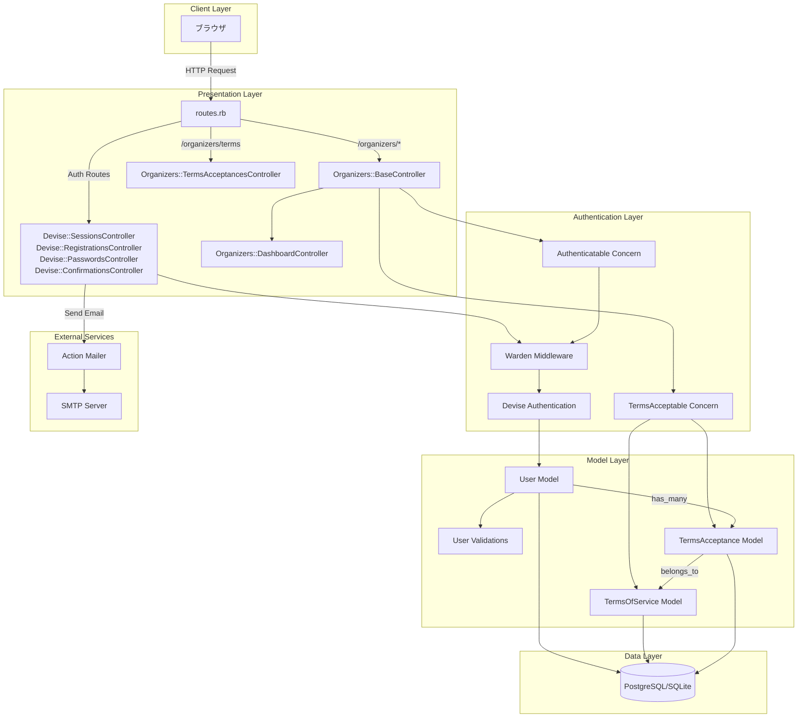
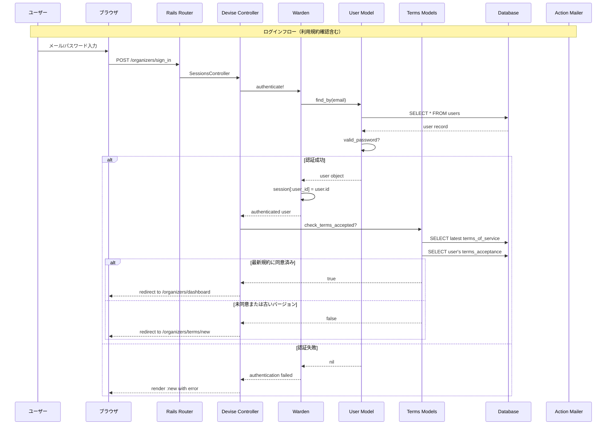
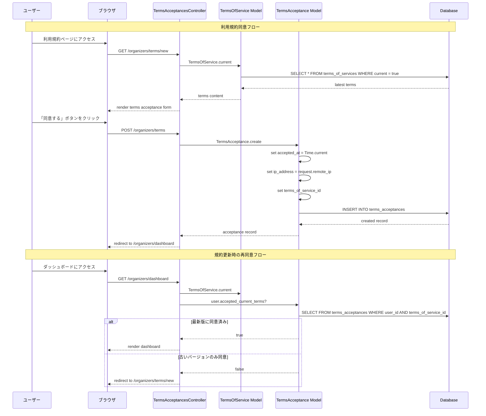
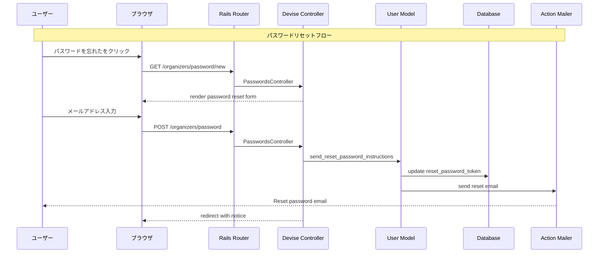

# Design Document

## Overview

運営組織（コンテスト主催者）向けアカウント認証システムの技術設計。DeviseをベースとしたRails 7.1標準の認証機構を実装し、Hotwire（Turbo + Stimulus）によるモダンなUI体験を提供する。運営者専用の名前空間（Organizers::）でアクセス制御を行い、セキュアで使いやすい認証フローを実現する。また、利用規約への同意確認機能を実装し、同意記録（日時、IPアドレス、規約バージョン）を法的証拠として保存する。

## Steering Document Alignment

### Technical Standards (tech.md)
- **Ruby on Rails 7.1**: フルスタックフレームワークとして使用
- **Devise**: 認証機能の標準ライブラリとして採用
- **Hotwire (Turbo + Stimulus)**: フォームのリアルタイムバリデーション、フラッシュメッセージ表示に活用
- **bcrypt**: パスワード暗号化（Deviseのデフォルト）
- **Action Mailer**: 確認メール、パスワードリセットメール送信

### Project Structure (structure.md)
- **app/controllers/organizers/**: 運営者向けコントローラー配置
- **app/models/user.rb**: Userモデル（role属性で権限管理）
- **app/models/terms_of_service.rb**: 利用規約モデル（バージョン管理）
- **app/models/terms_acceptance.rb**: 利用規約同意記録モデル
- **app/views/devise/**: Devise標準ビューのカスタマイズ
- **app/views/organizers/terms_acceptances/**: 利用規約同意画面
- **app/javascript/controllers/**: Stimulusコントローラー配置
- **config/routes.rb**: 名前空間ルーティング設定

## Code Reuse Analysis

### Existing Components to Leverage
- **Devise gem**: 認証の基盤機能（登録、ログイン、パスワードリセット、確認メール）
- **Rails標準機能**: CSRF保護、セッション管理、Strong Parameters
- **Action Mailer**: メール送信インフラ
- **Active Record**: データモデル、バリデーション

### Integration Points
- **ApplicationController**: 認証ヘルパーメソッドの共通化
- **routes.rb**: Devise routes + 名前空間ルーティング
- **database**: usersテーブル（Devise標準 + role拡張）、terms_of_servicesテーブル、terms_acceptancesテーブル
- **request.remote_ip**: 利用規約同意時のIPアドレス取得

## Architecture

運営者認証システムは、Devise標準のMVCアーキテクチャをベースに、運営者専用の名前空間でアクセス制御を行う。

### Modular Design Principles
- **Single File Responsibility**: 認証ロジックはDevise/concernsに集約、コントローラーは薄く保つ
- **Component Isolation**: 認証UI部品はパーシャルとして分離
- **Service Layer Separation**: 複雑なビジネスロジックはサービスオブジェクトに抽出（必要時）
- **Utility Modularity**: 認証ヘルパーはconcernとして実装



### Authentication Flow



### Terms Acceptance Flow



### Password Reset Flow



## Components and Interfaces

### Component 1: User Model
- **Purpose:** ユーザーデータの永続化と認証ロジックの基盤
- **Interfaces:**
  - `authenticate(email, password)`: 認証処理
  - `organizer?`: 運営者権限チェック
  - `admin?`: 管理者権限チェック
  - `participant?`: 参加者権限チェック
  - `lock_access!`: アカウントロック
  - `unlock_access!`: アカウントアンロック
- **Dependencies:** Devise, ActiveRecord
- **Reuses:** Devise::Models::Authenticatable, Devise::Models::Confirmable, Devise::Models::Lockable

### Component 2: Organizers::BaseController
- **Purpose:** 運営者エリアの共通認証・認可処理
- **Interfaces:**
  - `before_action :authenticate_user!`: 認証必須
  - `before_action :require_organizer!`: 運営者権限必須
- **Dependencies:** ApplicationController, Devise helpers
- **Reuses:** Devise controller helpers

### Component 3: Custom Devise Controllers
- **Purpose:** Deviseデフォルト動作のカスタマイズ（リダイレクト先、フラッシュメッセージ）
- **Interfaces:**
  - `Organizers::SessionsController`: ログイン/ログアウト
  - `Organizers::RegistrationsController`: アカウント登録
  - `Organizers::PasswordsController`: パスワードリセット
  - `Organizers::ConfirmationsController`: メール確認
- **Dependencies:** Devise base controllers
- **Reuses:** Devise::SessionsController, Devise::RegistrationsController, etc.

### Component 4: Authentication Concern
- **Purpose:** 認証関連のヘルパーメソッドを提供
- **Interfaces:**
  - `current_organizer`: 現在ログイン中の運営者を取得
  - `organizer_signed_in?`: 運営者ログイン状態チェック
  - `require_organizer!`: 運営者権限必須のフィルター
- **Dependencies:** Devise helpers
- **Reuses:** Devise `current_user`, `user_signed_in?`

### Component 5: Form Validation Controller (Stimulus)
- **Purpose:** フォームのリアルタイムバリデーションUI
- **Interfaces:**
  - `connect()`: 初期化
  - `validateEmail(event)`: メール形式チェック
  - `validatePassword(event)`: パスワード強度チェック
  - `validatePasswordConfirmation(event)`: パスワード一致チェック
- **Dependencies:** Stimulus framework
- **Reuses:** None (新規作成)

### Component 6: Organizers::TermsAcceptancesController
- **Purpose:** 利用規約の表示と同意記録の作成
- **Interfaces:**
  - `new`: 現在有効な利用規約を表示
  - `create`: 同意記録を作成（日時、IP、バージョン）
- **Dependencies:** TermsOfService, TermsAcceptance models
- **Reuses:** Organizers::BaseController（認証）

### Component 7: TermsAcceptable Concern
- **Purpose:** 利用規約同意状態のチェックと強制リダイレクト
- **Interfaces:**
  - `require_terms_acceptance!`: 最新規約への同意を必須とするフィルター
  - `current_terms`: 現在有効な利用規約を取得
  - `accepted_current_terms?`: 現在のユーザーが最新規約に同意済みかチェック
- **Dependencies:** TermsOfService, TermsAcceptance models
- **Reuses:** Devise `current_user`

### Component 8: TermsOfService Model
- **Purpose:** 利用規約のバージョン管理
- **Interfaces:**
  - `TermsOfService.current`: 現在有効な規約を取得
  - `version`: 規約バージョン（例: "1.0", "1.1"）
  - `content`: 規約本文
  - `published_at`: 公開日時
- **Dependencies:** ActiveRecord
- **Reuses:** None (新規作成)

### Component 9: TermsAcceptance Model
- **Purpose:** ユーザーの利用規約同意記録の永続化
- **Interfaces:**
  - `user`: 同意したユーザー
  - `terms_of_service`: 同意した規約バージョン
  - `accepted_at`: 同意日時
  - `ip_address`: 同意時のIPアドレス
- **Dependencies:** User, TermsOfService models
- **Reuses:** None (新規作成)

## Data Models

### User Model
```ruby
# app/models/user.rb
class User < ApplicationRecord
  # Devise modules
  devise :database_authenticatable, :registerable,
         :recoverable, :rememberable, :validatable,
         :confirmable, :lockable, :timeoutable, :trackable

  # Associations
  has_many :terms_acceptances, dependent: :destroy

  # Enums
  enum role: { participant: 0, organizer: 1, admin: 2 }

  # Validations
  validates :email, presence: true, uniqueness: true
  validates :password, length: { minimum: 8 }, if: :password_required?
  validates :role, presence: true

  # Instance methods
  def organizer?
    role == 'organizer' || role == 'admin'
  end

  def accepted_current_terms?
    current_terms = TermsOfService.current
    return true if current_terms.nil?
    terms_acceptances.exists?(terms_of_service: current_terms)
  end

  def accept_terms!(terms_of_service, ip_address)
    terms_acceptances.create!(
      terms_of_service: terms_of_service,
      accepted_at: Time.current,
      ip_address: ip_address
    )
  end
end
```

### TermsOfService Model
```ruby
# app/models/terms_of_service.rb
class TermsOfService < ApplicationRecord
  # Associations
  has_many :terms_acceptances, dependent: :restrict_with_error

  # Validations
  validates :version, presence: true, uniqueness: true
  validates :content, presence: true
  validates :published_at, presence: true

  # Scopes
  scope :published, -> { where.not(published_at: nil).where('published_at <= ?', Time.current) }
  scope :by_version, -> { order(published_at: :desc) }

  # Class methods
  def self.current
    published.by_version.first
  end
end
```

### TermsAcceptance Model
```ruby
# app/models/terms_acceptance.rb
class TermsAcceptance < ApplicationRecord
  # Associations
  belongs_to :user
  belongs_to :terms_of_service

  # Validations
  validates :accepted_at, presence: true
  validates :ip_address, presence: true
  validates :user_id, uniqueness: { scope: :terms_of_service_id, message: "has already accepted this version" }

  # Scopes
  scope :by_user, ->(user) { where(user: user) }
  scope :recent_first, -> { order(accepted_at: :desc) }
end
```

### Database Schema

#### Users Table
```ruby
# db/migrate/XXXXXX_devise_create_users.rb
create_table :users do |t|
  ## Database authenticatable
  t.string :email,              null: false, default: ""
  t.string :encrypted_password, null: false, default: ""

  ## Recoverable
  t.string   :reset_password_token
  t.datetime :reset_password_sent_at

  ## Rememberable
  t.datetime :remember_created_at

  ## Trackable
  t.integer  :sign_in_count, default: 0, null: false
  t.datetime :current_sign_in_at
  t.datetime :last_sign_in_at
  t.string   :current_sign_in_ip
  t.string   :last_sign_in_ip

  ## Confirmable
  t.string   :confirmation_token
  t.datetime :confirmed_at
  t.datetime :confirmation_sent_at
  t.string   :unconfirmed_email

  ## Lockable
  t.integer  :failed_attempts, default: 0, null: false
  t.string   :unlock_token
  t.datetime :locked_at

  ## Role
  t.integer :role, default: 0, null: false

  t.timestamps null: false
end

add_index :users, :email,                unique: true
add_index :users, :reset_password_token, unique: true
add_index :users, :confirmation_token,   unique: true
add_index :users, :unlock_token,         unique: true
```

#### TermsOfServices Table
```ruby
# db/migrate/XXXXXX_create_terms_of_services.rb
create_table :terms_of_services do |t|
  t.string :version, null: false          # バージョン番号（例: "1.0", "1.1"）
  t.text :content, null: false            # 規約本文
  t.datetime :published_at, null: false   # 公開日時

  t.timestamps null: false
end

add_index :terms_of_services, :version, unique: true
add_index :terms_of_services, :published_at
```

#### TermsAcceptances Table
```ruby
# db/migrate/XXXXXX_create_terms_acceptances.rb
create_table :terms_acceptances do |t|
  t.references :user, null: false, foreign_key: true
  t.references :terms_of_service, null: false, foreign_key: true
  t.datetime :accepted_at, null: false    # 同意日時
  t.string :ip_address, null: false       # 同意時のIPアドレス

  t.timestamps null: false
end

add_index :terms_acceptances, [:user_id, :terms_of_service_id], unique: true
add_index :terms_acceptances, :accepted_at
```

## Error Handling

### Error Scenarios
1. **Invalid credentials (認証失敗)**
   - **Handling:** Deviseのデフォルトエラーハンドリング + カスタムフラッシュメッセージ
   - **User Impact:** 「メールアドレスまたはパスワードが正しくありません」と表示

2. **Account locked (アカウントロック)**
   - **Handling:** Devise::Lockable + カスタムメッセージ
   - **User Impact:** 「アカウントがロックされています。30分後に再度お試しください」と表示

3. **Unconfirmed account (未確認アカウント)**
   - **Handling:** Devise::Confirmable + 確認メール再送オプション
   - **User Impact:** 「アカウントの確認が必要です。確認メールを再送信しますか？」と表示

4. **Expired reset token (リセットトークン期限切れ)**
   - **Handling:** Devise::Recoverable + 再発行フォーム
   - **User Impact:** 「リンクの有効期限が切れています」と表示、再発行オプション提供

5. **Unauthorized access (権限なしアクセス)**
   - **Handling:** before_action フィルター + 403レスポンス
   - **User Impact:** 403 Forbiddenページ表示

6. **Session expired (セッション期限切れ)**
   - **Handling:** Devise::Timeoutable + リダイレクト
   - **User Impact:** ログイン画面にリダイレクト、「セッションが期限切れです」と表示

7. **Terms not accepted (利用規約未同意)**
   - **Handling:** TermsAcceptable concern + before_action フィルター
   - **User Impact:** 利用規約同意画面にリダイレクト、「サービスを利用するには利用規約への同意が必要です」と表示

8. **Terms updated (利用規約更新)**
   - **Handling:** TermsAcceptable concern で最新バージョンとの比較
   - **User Impact:** 利用規約同意画面にリダイレクト、「利用規約が更新されました。続けてご利用いただくには新しい規約への同意が必要です」と表示

9. **Terms acceptance declined (利用規約への同意拒否)**
   - **Handling:** ログアウト処理へのリダイレクト
   - **User Impact:** 「利用規約に同意いただけない場合、サービスをご利用いただけません」と表示、ログアウトボタン提供

## Testing Strategy

### Unit Testing
- **User Model**: バリデーション、role判定メソッド、Deviseモジュール動作、利用規約同意状態チェック
- **TermsOfService Model**: バリデーション、currentスコープ
- **TermsAcceptance Model**: バリデーション、関連付け
- **Authentication Concern**: ヘルパーメソッドの動作確認
- **TermsAcceptable Concern**: 利用規約同意チェックロジック
- **テストツール**: RSpec + FactoryBot

```ruby
# spec/models/user_spec.rb
RSpec.describe User, type: :model do
  describe 'validations' do
    it { should validate_presence_of(:email) }
    it { should validate_uniqueness_of(:email).case_insensitive }
    it { should validate_length_of(:password).is_at_least(8) }
  end

  describe '#organizer?' do
    it 'returns true for organizer role' do
      user = build(:user, role: :organizer)
      expect(user.organizer?).to be true
    end
  end

  describe '#accepted_current_terms?' do
    let(:user) { create(:user, :organizer) }
    let(:terms) { create(:terms_of_service, :current) }

    it 'returns false when user has not accepted current terms' do
      expect(user.accepted_current_terms?).to be false
    end

    it 'returns true when user has accepted current terms' do
      user.accept_terms!(terms, '192.168.1.1')
      expect(user.accepted_current_terms?).to be true
    end
  end
end

# spec/models/terms_acceptance_spec.rb
RSpec.describe TermsAcceptance, type: :model do
  describe 'validations' do
    it { should validate_presence_of(:accepted_at) }
    it { should validate_presence_of(:ip_address) }
  end

  describe 'associations' do
    it { should belong_to(:user) }
    it { should belong_to(:terms_of_service) }
  end
end
```

### Integration Testing
- **認証フロー**: ログイン、ログアウト、パスワードリセットのリクエストテスト
- **利用規約フロー**: 同意画面表示、同意記録作成、リダイレクト
- **アクセス制御**: 未認証アクセス、権限なしアクセス、未同意アクセスのテスト
- **テストツール**: RSpec request specs

```ruby
# spec/requests/organizers/sessions_spec.rb
RSpec.describe "Organizers::Sessions", type: :request do
  describe "POST /organizers/sign_in" do
    let(:terms) { create(:terms_of_service, :current) }

    it "redirects to terms acceptance when terms not accepted" do
      user = create(:user, :organizer, :confirmed)
      post organizer_session_path, params: { user: { email: user.email, password: 'password123' } }
      expect(response).to redirect_to(new_organizers_terms_acceptance_path)
    end

    it "redirects to dashboard when terms already accepted" do
      user = create(:user, :organizer, :confirmed)
      user.accept_terms!(terms, '127.0.0.1')
      post organizer_session_path, params: { user: { email: user.email, password: 'password123' } }
      expect(response).to redirect_to(organizers_dashboard_path)
    end
  end
end

# spec/requests/organizers/terms_acceptances_spec.rb
RSpec.describe "Organizers::TermsAcceptances", type: :request do
  let(:user) { create(:user, :organizer, :confirmed) }
  let(:terms) { create(:terms_of_service, :current) }

  describe "POST /organizers/terms" do
    it "creates terms acceptance record with IP address" do
      sign_in user
      expect {
        post organizers_terms_acceptances_path
      }.to change(TermsAcceptance, :count).by(1)

      acceptance = TermsAcceptance.last
      expect(acceptance.user).to eq(user)
      expect(acceptance.terms_of_service).to eq(terms)
      expect(acceptance.ip_address).to be_present
      expect(acceptance.accepted_at).to be_present
    end
  end
end
```

### End-to-End Testing
- **ユーザージャーニー**: 登録→確認→ログイン→利用規約同意→ダッシュボード→ログアウト
- **エラーシナリオ**: ログイン失敗、アカウントロック、パスワードリセット、利用規約未同意
- **規約更新シナリオ**: 規約更新後の再同意フロー
- **テストツール**: RSpec + Capybara

```ruby
# spec/system/organizer_authentication_spec.rb
RSpec.describe "Organizer Authentication", type: :system do
  scenario "Organizer can sign up and confirm account" do
    visit new_organizer_registration_path
    fill_in "メールアドレス", with: "organizer@example.com"
    fill_in "パスワード", with: "password123"
    fill_in "パスワード（確認）", with: "password123"
    click_button "登録"

    expect(page).to have_content("確認メールを送信しました")
  end
end

# spec/system/terms_acceptance_spec.rb
RSpec.describe "Terms Acceptance", type: :system do
  let!(:terms) { create(:terms_of_service, :current, content: "利用規約の内容...") }

  scenario "Organizer must accept terms on first login" do
    user = create(:user, :organizer, :confirmed)

    visit new_organizer_session_path
    fill_in "メールアドレス", with: user.email
    fill_in "パスワード", with: "password123"
    click_button "ログイン"

    expect(page).to have_content("利用規約")
    expect(page).to have_content("利用規約の内容...")

    click_button "同意する"

    expect(page).to have_current_path(organizers_dashboard_path)
    expect(user.reload.accepted_current_terms?).to be true
  end

  scenario "Organizer must re-accept terms when updated" do
    user = create(:user, :organizer, :confirmed)
    user.accept_terms!(terms, '127.0.0.1')

    # Create new terms version
    new_terms = create(:terms_of_service, :current, version: "2.0", content: "新しい利用規約...")

    visit organizers_dashboard_path
    expect(page).to have_content("新しい利用規約...")

    click_button "同意する"

    expect(page).to have_current_path(organizers_dashboard_path)
    expect(user.terms_acceptances.count).to eq(2)
  end
end
```
