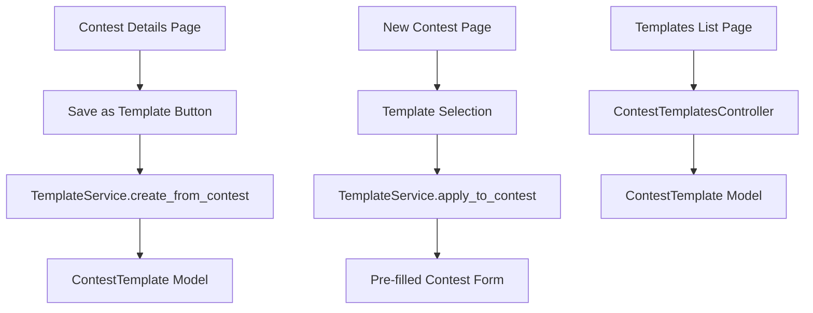

# Design Document: Contest Templates

## Overview

コンテストテンプレート機能は、主催者が過去に作成したコンテストの設定をテンプレートとして保存し、新規コンテスト作成時に再利用できる機能を提供する。ContestTemplate モデルでテンプレートデータを管理し、TemplateService で操作ロジックをカプセル化する。

## Steering Document Alignment

### Technical Standards (tech.md)

- **Rails 8**: Rails 8 の規約に従った実装
- **Hotwire (Turbo)**: テンプレート保存・選択にTurboを活用
- **Stimulus**: モーダル表示やフォーム切り替えに使用
- **Tailwind CSS**: 既存UIパターンに合わせたスタイリング

### Project Structure (structure.md)

- **Models**: `ContestTemplate` を `app/models/` 配下に配置
- **Controllers**: `Organizers::ContestTemplatesController` を `app/controllers/organizers/` 配下に配置
- **Services**: `TemplateService` を `app/services/` 配下に配置
- **Views**: `app/views/organizers/contest_templates/` 配下にビューを配置
- **名前空間**: `Organizers::` 名前空間で主催者向け機能として実装

## Code Reuse Analysis

### Existing Components to Leverage

- **Organizers::BaseController**: 認証・認可ロジック（`authenticate_user!`, `require_organizer!`）を継承
- **Organizers::ContestsController**: コンテスト作成フローを拡張
- **Contest モデル**: テンプレートに保存するフィールド定義を参照
- **Area モデル**: エリア関連の参照を活用
- **Category モデル**: カテゴリー関連の参照を活用

### Integration Points

- **既存ルーティング**: `namespace :organizers` 内にルートを追加
- **既存認可**: `BaseController` の `require_organizer!` でアクセス制御
- **既存ビューレイアウト**: 統一されたレイアウトとスタイリングを使用
- **コンテスト作成フォーム**: 既存フォームにテンプレート選択機能を追加

## Architecture

コンテストテンプレート機能は MVC + Service 層のアーキテクチャに従う。

### Modular Design Principles

- **Single File Responsibility**: ContestTemplate モデルはテンプレートデータの永続化のみを担当
- **Service Layer Separation**: テンプレート操作ロジックは TemplateService に委譲
- **Loose Coupling**: Contest モデルとの疎結合を維持（source_contest は参照のみ）



## Components and Interfaces

### Component 1: ContestTemplate Model

- **Purpose:** テンプレートデータを永続化する
- **Interfaces:**
  ```ruby
  class ContestTemplate < ApplicationRecord
    belongs_to :user
    belongs_to :source_contest, class_name: "Contest", optional: true
    belongs_to :category, optional: true
    belongs_to :area, optional: true

    validates :name, presence: true, length: { maximum: 100 }
    validates :user_id, presence: true

    scope :owned_by, ->(user) { where(user: user) }
    scope :recent, -> { order(created_at: :desc) }

    def owned_by?(user)
      user_id == user.id
    end
  end
  ```
- **Dependencies:** User, Contest, Category, Area モデル

### Component 2: TemplateService

- **Purpose:** テンプレート操作のビジネスロジックをカプセル化する
- **Interfaces:**
  ```ruby
  class TemplateService
    TEMPLATE_FIELDS = %i[
      theme description judging_method judge_weight prize_count
      moderation_enabled moderation_threshold require_spot
      area_id category_id
    ].freeze

    def self.create_from_contest(contest, name:, user:)
      # コンテストからテンプレートを作成
      # Returns: ContestTemplate or nil (with errors)
    end

    def self.apply_to_contest(template, contest)
      # テンプレートの設定をコンテストに適用
      # Returns: Contest (with assigned attributes, not saved)
    end

    def self.template_attributes(contest)
      # コンテストからテンプレート用属性を抽出
      # Returns: Hash
    end
  end
  ```
- **Dependencies:** ContestTemplate, Contest モデル

### Component 3: Organizers::ContestTemplatesController

- **Purpose:** テンプレートのCRUD操作を処理する
- **Interfaces:**
  ```ruby
  class Organizers::ContestTemplatesController < Organizers::BaseController
    def index    # テンプレート一覧表示
    def new      # テンプレート作成フォーム（コンテストから）
    def create   # テンプレート保存
    def destroy  # テンプレート削除
  end
  ```
- **Dependencies:** TemplateService, ContestTemplate, Contest モデル
- **Reuses:** Organizers::BaseController（認証・認可）

### Component 4: Contest作成フォーム拡張

- **Purpose:** テンプレートからコンテスト作成の導線を提供
- **Interfaces:**
  - `Organizers::ContestsController#new` にテンプレート選択パラメータを追加
  - テンプレート選択UI（ドロップダウンまたはモーダル）
- **Dependencies:** ContestTemplate モデル、既存コンテストフォーム

## Data Models

### 新規モデル: ContestTemplate

```ruby
# db/migrate/YYYYMMDDHHMMSS_create_contest_templates.rb
create_table :contest_templates do |t|
  t.references :user, null: false, foreign_key: true
  t.references :source_contest, foreign_key: { to_table: :contests }
  t.string :name, null: false, limit: 100

  # テンプレートに保存される設定項目
  t.string :theme, limit: 255
  t.text :description
  t.integer :judging_method, default: 0
  t.integer :judge_weight
  t.integer :prize_count
  t.boolean :moderation_enabled, default: true
  t.decimal :moderation_threshold, precision: 5, scale: 2
  t.boolean :require_spot, default: false
  t.references :area, foreign_key: true
  t.references :category, foreign_key: true

  t.timestamps

  t.index [:user_id, :name], unique: true
end
```

### データフロー

```
1. テンプレート保存:
   Contest → TemplateService.create_from_contest → ContestTemplate

2. テンプレートから作成:
   ContestTemplate → TemplateService.apply_to_contest → Contest (new)

3. テンプレート一覧:
   User → ContestTemplate.owned_by(user) → Templates List
```

## Error Handling

### Error Scenarios

1. **テンプレート名が空の場合**
   - **Handling:** バリデーションエラー、フォームに戻る
   - **User Impact:** 「テンプレート名を入力してください」メッセージ

2. **同名テンプレートが既に存在**
   - **Handling:** ユニーク制約エラー、フォームに戻る
   - **User Impact:** 「同じ名前のテンプレートが既に存在します」メッセージ

3. **他主催者のテンプレートにアクセス**
   - **Handling:** `owned_by?` チェック、失敗時はリダイレクト
   - **User Impact:** 「このテンプレートにアクセスする権限がありません」メッセージ

4. **存在しないテンプレートを選択**
   - **Handling:** RecordNotFound、エラーページまたはリダイレクト
   - **User Impact:** 「テンプレートが見つかりません」メッセージ

5. **元コンテストが削除済み**
   - **Handling:** source_contest は optional、削除されても影響なし
   - **User Impact:** テンプレート一覧で「(削除済み)」と表示

## Testing Strategy

### Unit Testing

- **ContestTemplate Model**:
  - バリデーションテスト（name必須、長さ制限）
  - ユニーク制約テスト（user_id + name）
  - 関連テスト（belongs_to user, source_contest, category, area）
  - owned_by? メソッドテスト

- **TemplateService**:
  - create_from_contest: 正常系、バリデーションエラー
  - apply_to_contest: フィールドが正しくコピーされる
  - template_attributes: 必要なフィールドのみ抽出される

### Integration Testing (Request Specs)

- **Organizers::ContestTemplatesController**:
  - index: 認証なし→リダイレクト、認証あり→一覧表示
  - create: 正常保存、バリデーションエラー
  - destroy: 正常削除、他主催者のテンプレート→アクセス拒否

- **Organizers::ContestsController#new**:
  - template_id パラメータありでプリセットされる
  - 存在しないtemplate_id→エラーハンドリング

### End-to-End Testing (System Specs)

- 主催者がコンテスト詳細からテンプレートを保存
- 主催者がテンプレート一覧を表示
- 主催者がテンプレートから新規コンテストを作成
- 主催者がテンプレートを削除

## Implementation Notes

### Routes

```ruby
# config/routes.rb
namespace :organizers do
  resources :contests do
    resource :statistics, only: [:show]
  end
  resources :contest_templates, only: [:index, :new, :create, :destroy]
end
```

- GET `/organizers/contest_templates` - テンプレート一覧
- GET `/organizers/contest_templates/new?contest_id=X` - テンプレート作成フォーム
- POST `/organizers/contest_templates` - テンプレート保存
- DELETE `/organizers/contest_templates/:id` - テンプレート削除

### UI/UX Considerations

1. **テンプレート保存導線**:
   - コンテスト詳細ページに「テンプレートとして保存」ボタン
   - クリックでモーダルまたは新規ページでテンプレート名入力

2. **テンプレートから作成導線**:
   - コンテスト新規作成画面の上部に「テンプレートから作成」セクション
   - テンプレートがない場合は非表示
   - ドロップダウンでテンプレート選択後、フォームがプリセットされる

3. **テンプレート一覧**:
   - サイドメニューに「テンプレート」リンク追加
   - 各テンプレートに「このテンプレートから作成」「削除」ボタン

### Turbo/Stimulus Integration

- テンプレート保存: Turbo Frame でモーダル表示
- テンプレート選択: Stimulus コントローラーでフォーム更新
- 削除確認: Turbo Confirm または Stimulus でダイアログ表示
