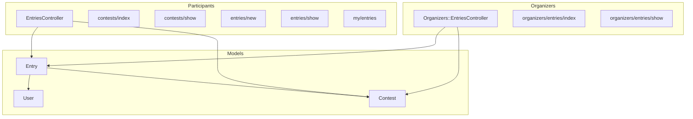
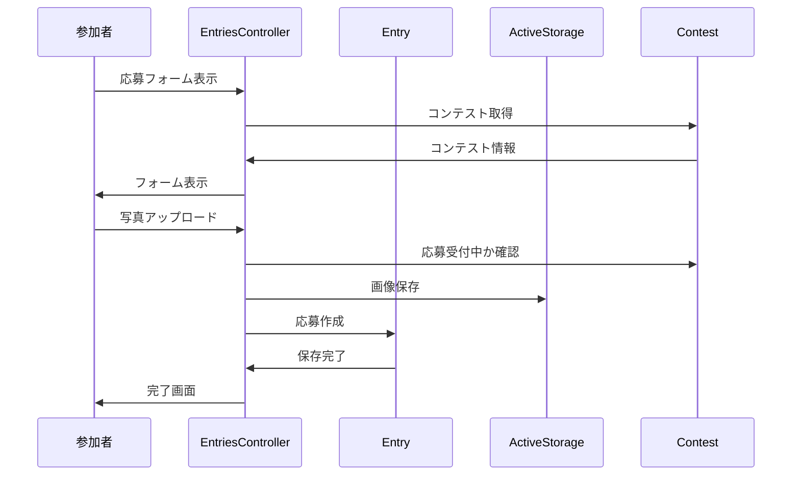

# Design Document

## Overview

写真投稿機能は、参加者がフォトコンテストに写真を応募するための機能を提供する。Entry モデルを中心に、参加者向けの応募機能と運営者向けの応募管理機能を実装する。

## Steering Document Alignment

### Technical Standards (tech.md)
- Ruby on Rails 7.1 の MVC アーキテクチャに従う
- Active Storage による画像管理
- Hotwire (Turbo + Stimulus) を活用したインタラクティブ UI
- RSpec によるテスト駆動開発

### Project Structure (structure.md)
- 参加者向けコントローラー: `app/controllers/entries_controller.rb`
- 運営者向けコントローラー: `app/controllers/organizers/entries_controller.rb`
- モデル: `app/models/entry.rb`
- 参加者向けビュー: `app/views/entries/`
- 運営者向けビュー: `app/views/organizers/entries/`

## Code Reuse Analysis

### Existing Components to Leverage
- **Contest モデル**: 応募先コンテストとして関連付け（belongs_to :contest）
- **User モデル**: 応募者として関連付け（belongs_to :user）
- **Active Storage**: 画像アップロード・管理
- **ApplicationController**: 認証機能（authenticate_user!）
- **Organizers::BaseController**: 運営者向け認証・権限
- **shared partials**: レイアウトコンポーネント
- **Tailwind CSS**: 既存のデザインシステム

### Integration Points
- **Routes**: `resources :entries` を追加（参加者向け）
- **Routes**: `namespace :organizers` 内に entries を追加（運営者向け）
- **Contest 関連**: `has_many :entries` を Contest モデルに追加
- **User 関連**: `has_many :entries` を User モデルに追加

## Architecture

### 全体構成



### データフロー



### Modular Design Principles
- **Single File Responsibility**: Entry モデルは応募情報のみ管理
- **Component Isolation**: フォームは _form パーシャルに分離
- **Service Layer Separation**: 画像処理は Active Storage に委譲
- **Namespace Separation**: 参加者向けと運営者向けを分離

## Components and Interfaces

### Entry Model
- **Purpose:** 応募情報と画像を管理
- **Interfaces:**
  - `#editable?` - 編集可能かどうか（応募期間内 AND 本人）
  - `#deletable?` - 削除可能かどうか（応募期間内 AND 本人）
  - `.by_contest(contest)` - コンテストでフィルタ
  - `.by_user(user)` - ユーザーでフィルタ
  - `.recent` - 新しい順にソート
- **Dependencies:** ApplicationRecord, User, Contest, ActiveStorage
- **Reuses:** Active Storage for image management

### EntriesController (Participants)
- **Purpose:** 参加者向けの応募 CRUD 操作を提供
- **Interfaces:**
  - `GET /contests` - 公開中コンテスト一覧
  - `GET /contests/:contest_id` - コンテスト詳細
  - `GET /contests/:contest_id/entries/new` - 応募フォーム
  - `POST /contests/:contest_id/entries` - 応募作成
  - `GET /entries/:id` - 応募詳細
  - `GET /entries/:id/edit` - 応募編集フォーム
  - `PATCH /entries/:id` - 応募更新
  - `DELETE /entries/:id` - 応募削除
  - `GET /my/entries` - マイ応募一覧
- **Dependencies:** ApplicationController, Entry, Contest
- **Reuses:** 認証（Devise）

### Organizers::EntriesController
- **Purpose:** 運営者向けの応募管理を提供
- **Interfaces:**
  - `GET /organizers/contests/:contest_id/entries` - 応募一覧
  - `GET /organizers/contests/:contest_id/entries/:id` - 応募詳細
- **Dependencies:** Organizers::BaseController, Entry, Contest
- **Reuses:** 認証・権限チェック（BaseController から継承）

## Data Models

### Entry Model

```ruby
# db/migrate/XXXXXX_create_entries.rb
create_table :entries do |t|
  t.references :user, null: false, foreign_key: true      # 応募者
  t.references :contest, null: false, foreign_key: true   # コンテスト
  t.string :title, limit: 100                             # タイトル（任意）
  t.text :description                                      # 説明文（任意）
  t.string :location, limit: 255                          # 撮影場所（任意）
  t.date :taken_at                                         # 撮影日（任意）
  t.timestamps
end

add_index :entries, [:user_id, :contest_id]
add_index :entries, :contest_id
```

### Entry Model Implementation

```ruby
# app/models/entry.rb
class Entry < ApplicationRecord
  # Associations
  belongs_to :user
  belongs_to :contest
  has_one_attached :photo

  # Validations
  validates :photo, presence: true
  validates :title, length: { maximum: 100 }, allow_blank: true
  validates :location, length: { maximum: 255 }, allow_blank: true
  validate :contest_accepting_entries, on: :create
  validate :photo_content_type
  validate :photo_size

  # Scopes
  scope :by_contest, ->(contest) { where(contest: contest) }
  scope :by_user, ->(user) { where(user: user) }
  scope :recent, -> { order(created_at: :desc) }

  # Instance Methods
  def editable?
    contest.accepting_entries?
  end

  def deletable?
    contest.accepting_entries?
  end

  def owned_by?(other_user)
    user_id == other_user.id
  end

  private

  def contest_accepting_entries
    return if contest&.accepting_entries?
    errors.add(:base, "このコンテストは現在応募を受け付けていません")
  end

  def photo_content_type
    return unless photo.attached?
    unless photo.content_type.in?(%w[image/jpeg image/png image/gif])
      errors.add(:photo, "はJPEG、PNG、GIF形式のみ対応しています")
    end
  end

  def photo_size
    return unless photo.attached?
    if photo.byte_size > 10.megabytes
      errors.add(:photo, "は10MB以下にしてください")
    end
  end
end
```

### Model Updates

```ruby
# app/models/contest.rb に追加
has_many :entries, dependent: :destroy

# app/models/user.rb に追加
has_many :entries, dependent: :destroy
```

## Error Handling

### Error Scenarios

1. **バリデーションエラー（写真未選択など）**
   - **Handling:** モデルバリデーションでエラー検出、フォームに戻る
   - **User Impact:** エラーメッセージが表示され、入力内容は保持される

2. **権限エラー（他ユーザーの応募編集）**
   - **Handling:** before_action で所有者チェック、403 Forbidden を返す
   - **User Impact:** 「この操作を行う権限がありません」メッセージ表示

3. **期間外エラー（応募期間外での操作）**
   - **Handling:** モデルバリデーションまたはコントローラーでチェック
   - **User Impact:** 「応募期間外です」メッセージ表示

4. **ファイルサイズエラー**
   - **Handling:** モデルバリデーションでチェック
   - **User Impact:** 「10MB以下の画像を選択してください」メッセージ

5. **ファイル形式エラー**
   - **Handling:** モデルバリデーションでチェック
   - **User Impact:** 「JPEG、PNG、GIF形式のみ対応しています」メッセージ

## Testing Strategy

### Unit Testing (RSpec Model Specs)
- Entry モデルのバリデーションテスト
- 応募期間チェックのテスト
- ファイルサイズ・形式バリデーションのテスト
- スコープ（by_contest, by_user）のテスト
- editable?, deletable? のテスト

### Integration Testing (RSpec Request Specs)
- CRUD 各アクションの正常系テスト
- 認証が必要なことの確認
- 権限チェック（他ユーザーの応募操作拒否）
- 応募期間外での操作拒否

### End-to-End Testing (RSpec System Specs)
- 応募フローの E2E テスト
- 画像アップロードのテスト
- 応募編集・削除フローのテスト

## View Components

### 参加者向けコンテスト一覧 (contests/index.html.erb)
- 応募受付中のコンテストカードグリッド
- 空状態の表示

### 参加者向けコンテスト詳細 (contests/show.html.erb)
- コンテスト情報の表示
- 応募ボタン（応募受付中のみ）
- 応募期間外の場合のメッセージ

### 応募フォーム (entries/_form.html.erb)
- 写真アップロード（ドラッグ＆ドロップ対応）
- タイトル入力（任意）
- 説明文テキストエリア（任意）
- 撮影場所入力（任意）
- 撮影日入力（任意）

### マイ応募一覧 (my/entries/index.html.erb)
- 応募作品のカードグリッド
- 空状態の表示

### 運営者向け応募一覧 (organizers/entries/index.html.erb)
- 応募作品のテーブル表示
- フィルター機能

## Routes Configuration

```ruby
# config/routes.rb

# 参加者向け（認証必須）
resources :contests, only: [:index, :show] do
  resources :entries, only: [:new, :create], shallow: true
end
resources :entries, only: [:show, :edit, :update, :destroy]

namespace :my do
  resources :entries, only: [:index]
end

# 運営者向け
namespace :organizers do
  resources :contests do
    resources :entries, only: [:index, :show]
    # 既存の member routes
    member do
      patch :publish
      patch :finish
    end
  end
end
```
