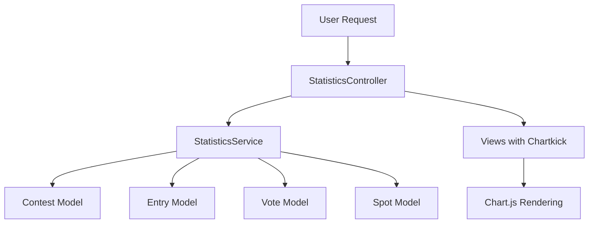

# Design Document: Statistics Dashboard

## Overview

統計ダッシュボードは、コンテスト主催者が応募状況、人気スポット、投票傾向を視覚的に把握するためのダッシュボードを提供する。Chartkick + Chart.js を活用してグラフ表示を行い、StatisticsService によってビジネスロジックを分離する。

## Steering Document Alignment

### Technical Standards (tech.md)

- **Chartkick + Chart.js**: tech.md で指定されたグラフライブラリを使用
- **Hotwire (Turbo)**: ページ遷移に Turbo を活用し、SPAライクな体験を提供
- **Tailwind CSS**: 既存の UI パターンに合わせたスタイリング
- **Rails 8**: Rails 8 の規約に従った実装

### Project Structure (structure.md)

- **Controllers**: `Organizers::StatisticsController` を `app/controllers/organizers/` 配下に配置
- **Services**: `StatisticsService` を `app/services/` 配下に配置
- **Views**: `app/views/organizers/statistics/` 配下にビューを配置
- **名前空間**: `Organizers::` 名前空間で運営者向け機能として実装

## Code Reuse Analysis

### Existing Components to Leverage

- **Organizers::BaseController**: 認証・認可ロジック（`authenticate_user!`, `require_organizer!`）を継承
- **Contest モデル**: 既存の `has_many :entries`, `has_many :spots` 関連を活用
- **Entry モデル**: `votes`, `spot` 関連を活用して統計を集計
- **Vote モデル**: 投票データの集計に使用
- **Spot モデル**: スポット別集計に使用

### Integration Points

- **既存ルーティング**: `namespace :organizers` 内にルートを追加
- **既存認可**: `BaseController` の `require_organizer!` でアクセス制御
- **既存ビューレイアウト**: 統一されたレイアウトとスタイリングを使用

## Architecture

統計ダッシュボードは MVC + Service 層のアーキテクチャに従う。

### Modular Design Principles

- **Single File Responsibility**: StatisticsService は統計計算のみを担当
- **Component Isolation**: グラフコンポーネントはパーシャルとして分離
- **Service Layer Separation**: コントローラーはデータ取得のみ、計算ロジックはサービスに委譲



## Components and Interfaces

### Component 1: StatisticsService

- **Purpose:** コンテストの統計データを計算・集約する
- **Interfaces:**
  ```ruby
  class StatisticsService
    def initialize(contest)
    def summary_stats         # サマリーカード用データ
    def daily_entries         # 日別応募数データ
    def weekly_entries        # 週別応募数データ（7日以上の場合）
    def spot_rankings(limit:) # スポット別応募ランキング
    def area_distribution     # エリア別応募分布
    def daily_votes           # 日別投票数データ
    def vote_summary          # 投票サマリー（総数、ユニーク数、平均）
    def top_voted_entries(limit:) # 上位得票作品
  end
  ```
- **Dependencies:** Contest, Entry, Vote, Spot, Area モデル
- **Reuses:** ActiveRecord クエリインターフェース

### Component 2: Organizers::StatisticsController

- **Purpose:** 統計ダッシュボードのリクエストを処理する
- **Interfaces:**
  ```ruby
  class Organizers::StatisticsController < Organizers::BaseController
    def show  # メインダッシュボード表示
  end
  ```
- **Dependencies:** StatisticsService, Contest モデル
- **Reuses:** Organizers::BaseController（認証・認可）

### Component 3: グラフパーシャル

- **Purpose:** 再利用可能なグラフコンポーネントを提供
- **Interfaces:**
  - `_entry_trend_chart.html.erb` - 応募数推移グラフ
  - `_spot_chart.html.erb` - スポット別棒グラフ
  - `_area_pie_chart.html.erb` - エリア別円グラフ
  - `_vote_trend_chart.html.erb` - 投票数推移グラフ
  - `_summary_cards.html.erb` - サマリーカード
  - `_top_entries.html.erb` - 上位得票作品リスト
- **Dependencies:** Chartkick ヘルパー
- **Reuses:** 既存の Tailwind CSS クラス

## Data Models

### 新規モデル: なし

既存モデルのみを使用して統計を計算する。新規テーブルやモデルの追加は不要。

### 統計データ構造（サービス戻り値）

```ruby
# summary_stats の戻り値
{
  total_entries: Integer,
  total_votes: Integer,
  total_participants: Integer,  # 応募者数（ユニークユーザー数）
  total_spots: Integer,
  entries_change: Integer,      # 前日比（nil if no previous data）
  votes_change: Integer,
  participants_change: Integer,
  spots_change: Integer
}

# daily_entries / daily_votes の戻り値
{
  Date => Integer,  # 日付 => 件数のハッシュ（Chartkick対応形式）
  ...
}

# spot_rankings の戻り値
[
  { spot: Spot, count: Integer },
  ...
]

# area_distribution の戻り値
{
  "エリア名" => Integer,  # エリア名 => 件数
  ...
}

# vote_summary の戻り値
{
  total: Integer,
  unique_voters: Integer,
  average_per_entry: Float
}

# top_voted_entries の戻り値
[
  { entry: Entry, votes_count: Integer },
  ...
]
```

## Error Handling

### Error Scenarios

1. **データがない場合**
   - **Handling:** 空の状態でも正常にレンダリング、適切なメッセージを表示
   - **User Impact:** 「まだデータがありません」メッセージを確認

2. **投票期間開始前**
   - **Handling:** 投票関連セクションで「投票期間開始後に表示されます」を表示
   - **User Impact:** 投票統計は非表示、他のセクションは正常表示

3. **統計計算エラー**
   - **Handling:** 個別セクションでのエラーは他セクションに影響させない。Rails.logger でエラーをログ
   - **User Impact:** エラーが発生したセクションは「データを取得できませんでした」を表示

4. **他主催者のコンテストアクセス**
   - **Handling:** `set_contest` で `owned_by?` チェック、失敗時はリダイレクト
   - **User Impact:** 「このコンテストにアクセスする権限がありません」メッセージ

## Testing Strategy

### Unit Testing

- **StatisticsService**: 各メソッドの計算ロジックをテスト
  - 空データでの動作
  - 正常データでの計算結果
  - 前日比計算の正確性
  - エッジケース（1件のみ、大量データ等）

### Integration Testing (Request Specs)

- **Organizers::StatisticsController**:
  - 認証なしでのアクセス → ログインリダイレクト
  - 他主催者のコンテストアクセス → アクセス拒否
  - 正常アクセス → 200 レスポンス
  - データありでのビュー確認

### End-to-End Testing (System Specs)

- 主催者がダッシュボードにアクセスしてグラフが表示される
- サマリーカードに正しい数値が表示される
- スポット別棒グラフをクリックして応募一覧に遷移

## Implementation Notes

### Chartkick Setup

1. Gemfile に `gem "chartkick"` を追加
2. `config/importmap.rb` に Chart.js と Chartkick をピン
3. `app/javascript/application.js` で Chartkick をインポート

### Performance Considerations

- N+1 クエリを避けるため `includes` を活用
- 大量データ時はキャッシュを検討（Rails.cache）
- グループ集計は SQL レベルで実行（Ruby での処理を最小化）

### Routes

```ruby
# config/routes.rb
namespace :organizers do
  resources :contests do
    resource :statistics, only: [:show]
  end
end
```

これにより `/organizers/contests/:contest_id/statistics` でアクセス可能。
