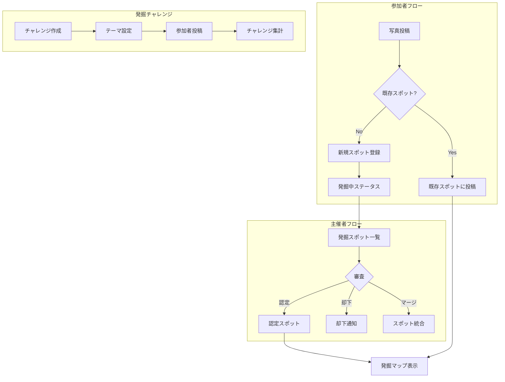

# Design Document: Tourism Integration

## Overview

観光連携機能は、既存のSpotモデルを拡張し、参加者が新規スポットを「発掘」できる仕組みを実装します。主な構成要素として、スポット発掘ステータス管理、発掘チャレンジ、スポット投票、発掘バッジシステムを導入します。既存のギャラリーマップを拡張して発掘マップとして活用し、未開拓エリアの可視化機能を追加します。

## Steering Document Alignment

### Technical Standards (tech.md)
- **Ruby on Rails 8.0**: 既存のMVCアーキテクチャに従う
- **Hotwire (Turbo + Stimulus)**: マップインタラクションにStimulusを活用
- **Active Storage**: 発掘スポット写真は既存のEntry経由で管理
- **Service層**: DiscoverySpotServiceでビジネスロジックをカプセル化

### Project Structure (structure.md)
- **Controllers**: `organizers/discovery_spots_controller.rb`, `discovery_challenges_controller.rb`
- **Models**: Spotモデル拡張、DiscoveryChallenge、SpotVote、DiscoveryBadge
- **Views**: 既存のorganizers/spots、gallery/mapビューを拡張
- **Services**: `discovery_spot_service.rb`

## Code Reuse Analysis

### Existing Components to Leverage
- **Spot モデル**: 拡張して発掘ステータス、発見者情報を追加
- **GalleryController**: マップ表示ロジックを再利用、発掘マップとして拡張
- **Vote モデル**: SpotVoteの参考パターン
- **Notification システム**: スポット認定通知に活用
- **StatisticsService**: 発掘統計の参考パターン

### Integration Points
- **Entry → Spot**: 新規スポット作成時にEntryから連携
- **Contest → DiscoveryChallenge**: コンテストに紐づくチャレンジ
- **User → DiscoveryBadge**: ユーザーの発掘実績

## Architecture



### Modular Design Principles
- **Single File Responsibility**: 発掘ロジックはDiscoverySpotServiceに集約
- **Component Isolation**: チャレンジ機能は独立モジュール
- **Service Layer Separation**: コントローラーは薄く、ロジックはServiceへ
- **Utility Modularity**: 距離計算はGeoUtilityモジュールに分離

## Components and Interfaces

### DiscoverySpotService
- **Purpose:** 発掘スポットの作成・認定・統計計算を担当
- **Interfaces:**
  - `create_discovered_spot(entry:, name:, coordinates:, comment:)` - 新規発掘スポット作成
  - `certify_spot(spot:, user:)` - スポットを認定
  - `reject_spot(spot:, user:, reason:)` - スポットを却下
  - `merge_spots(target:, sources:)` - 重複スポットの統合
  - `find_nearby_spots(lat:, lng:, radius_m: 50)` - 近接スポット検索
  - `discovery_statistics(contest:)` - 発掘統計取得
- **Dependencies:** Spot, Entry, Notification, User
- **Reuses:** StatisticsServiceのパターン

### Organizers::DiscoverySpotsController
- **Purpose:** 主催者向け発掘スポット管理
- **Interfaces:**
  - `index` - 発掘中スポット一覧
  - `certify` - スポット認定
  - `reject` - スポット却下
  - `merge` - スポット統合
- **Dependencies:** DiscoverySpotService, Contest, Spot
- **Reuses:** ModerationControllerのパターン

### DiscoveryChallengesController
- **Purpose:** 発掘チャレンジのCRUD
- **Interfaces:**
  - `index`, `new`, `create`, `edit`, `update`, `destroy`
- **Dependencies:** DiscoveryChallenge, Contest
- **Reuses:** SpotsControllerのパターン

### SpotVotesController
- **Purpose:** スポットへの投票管理
- **Interfaces:**
  - `create` - 投票
  - `destroy` - 投票取消
- **Dependencies:** SpotVote, Spot, User
- **Reuses:** VotesControllerのパターン

### DiscoveryMapController (Stimulus)
- **Purpose:** 発掘マップのインタラクティブ機能
- **Interfaces:**
  - `connect()` - マップ初期化
  - `showUnexploredAreas()` - 未開拓エリア表示
  - `toggleHeatmap()` - ヒートマップ切替
  - `filterByStatus(status)` - ステータスフィルター
- **Dependencies:** Leaflet.js, 既存のmap_controller
- **Reuses:** 既存のmap_controller.jsを拡張

## Data Models

### Spot (拡張)
```ruby
# 既存フィールドに追加
- discovery_status: integer (enum: organizer_created, discovered, certified, rejected)
- discovered_by_id: integer (references users, 発見者)
- discovered_at: datetime
- discovery_comment: text (発見コメント)
- certified_by_id: integer (references users, 認定者)
- certified_at: datetime
- rejection_reason: text
- votes_count: integer (counter cache)
```

### DiscoveryChallenge (新規)
```ruby
- id: bigint (primary key)
- contest_id: integer (references contests, null: false)
- name: string (limit: 100, null: false)
- description: text
- theme: string (limit: 100)
- starts_at: datetime
- ends_at: datetime
- status: integer (enum: draft, active, finished)
- created_at: datetime
- updated_at: datetime
```

### SpotVote (新規)
```ruby
- id: bigint (primary key)
- user_id: integer (references users, null: false)
- spot_id: integer (references spots, null: false)
- created_at: datetime
- updated_at: datetime
# ユニーク制約: user_id + spot_id
```

### DiscoveryBadge (新規)
```ruby
- id: bigint (primary key)
- user_id: integer (references users, null: false)
- contest_id: integer (references contests, null: false)
- badge_type: integer (enum: pioneer, explorer, curator, master)
- earned_at: datetime
- metadata: json (バッジ取得時の詳細情報)
- created_at: datetime
- updated_at: datetime
# ユニーク制約: user_id + contest_id + badge_type
```

### ChallengeEntry (新規、中間テーブル)
```ruby
- id: bigint (primary key)
- discovery_challenge_id: integer (references discovery_challenges, null: false)
- entry_id: integer (references entries, null: false)
- created_at: datetime
# ユニーク制約: discovery_challenge_id + entry_id
```

## Error Handling

### Error Scenarios
1. **近接スポットの重複登録**
   - **Handling:** 50m以内に既存スポットがある場合、確認ダイアログを表示
   - **User Impact:** 「近くに既存スポット『○○』があります。こちらに投稿しますか？」と選択肢を提示

2. **権限のない認定操作**
   - **Handling:** authorize_contest!でブロック、403エラー
   - **User Impact:** 「この操作を行う権限がありません」とフラッシュ表示、リダイレクト

3. **無効な位置情報**
   - **Handling:** 緯度経度の範囲チェック（日本国内 or 設定エリア内）
   - **User Impact:** 「有効な位置を選択してください」とバリデーションエラー

4. **チャレンジ期間外の投稿**
   - **Handling:** チャレンジのstarts_at/ends_atでバリデーション
   - **User Impact:** 「このチャレンジは終了しました」とエラー表示

5. **認定済みスポットへの重複投票**
   - **Handling:** ユニーク制約でブロック
   - **User Impact:** 投票ボタンがトグル表示（投票済み状態）

## Testing Strategy

### Unit Testing
- **Spot モデル**: discovery_status遷移、バリデーション、スコープ
- **DiscoveryChallenge モデル**: 期間バリデーション、ステータス遷移
- **SpotVote モデル**: ユニーク制約、カウンターキャッシュ
- **DiscoveryBadge モデル**: バッジ付与条件、重複防止
- **DiscoverySpotService**: 各メソッドの正常系・異常系

### Integration Testing
- **発掘フロー**: 写真投稿 → 新規スポット登録 → 認定 → マップ表示
- **チャレンジフロー**: チャレンジ作成 → 参加 → 終了 → 集計
- **投票フロー**: 認定スポット表示 → 投票 → ランキング更新
- **バッジ付与**: 条件達成 → バッジ付与 → マイページ表示

### End-to-End Testing
- **参加者シナリオ**:
  - 新規スポットを発掘して投稿
  - 発掘マップで未開拓エリアを確認
  - チャレンジに参加
  - 他者の発掘スポットに投票
- **主催者シナリオ**:
  - 発掘スポットを審査・認定
  - 重複スポットをマージ
  - 発掘チャレンジを作成・管理
  - 発掘統計を確認
