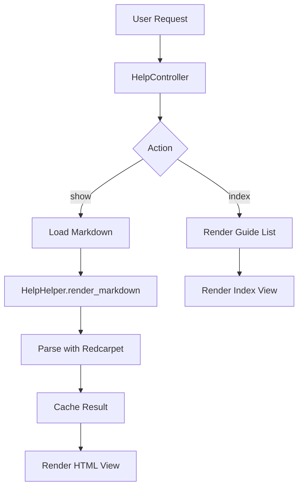

# Design Document: User Documentation Access

## Overview

ユーザーマニュアル（`doc/manual/`に格納されたMarkdownファイル）をアプリケーション内から閲覧できる機能を実装する。各ユーザーロール（参加者・主催者・審査員・管理者）に応じたマニュアルへのアクセスを提供し、ヘッダー、フッター、サイドバーからリンクする。

## Steering Document Alignment

### Technical Standards (tech.md)

- **フレームワーク**: Ruby on Rails 8.0 + Hotwire
- **フロントエンド**: Tailwind CSS、Stimulus.js
- **キャッシュ**: Rails標準キャッシュ機構を使用
- **テスト**: RSpec + Capybara

### Project Structure (structure.md)

- **コントローラー**: `app/controllers/help_controller.rb`（publicアクセス）
- **ビュー**: `app/views/help/`配下に配置
- **ヘルパー**: `app/helpers/help_helper.rb`
- **テスト**: `spec/requests/help_spec.rb`、`spec/system/help_spec.rb`

## Code Reuse Analysis

### Existing Components to Leverage

- **`app/views/layouts/application.html.erb`**: メインレイアウト（ヘッダー・フッター含む）
- **`app/views/shared/_header.html.erb`**: ヘッダーナビゲーション（ヘルプリンク追加先）
- **`app/views/shared/_footer.html.erb`**: フッター（利用ガイドリンク追加先）
- **`app/views/shared/_sidebar.html.erb`**: 主催者サイドバー（ヘルプセクション追加先）
- **`app/views/layouts/admin.html.erb`**: 管理者レイアウト（管理者ガイドリンク追加先）

### Integration Points

- **ルーティング**: `config/routes.rb`に `/help` ルート追加
- **i18n**: `config/locales/ja.yml`にヘルプ関連テキスト追加
- **Markdownファイル**: `doc/manual/*.md`を読み込み

## Architecture

Markdownファイルをサーバーサイドでパースしてキャッシュし、HTMLとして表示する。認証不要でアクセス可能にし、SEOにも対応する。

### Modular Design Principles

- **Single File Responsibility**: HelpControllerは表示専用、パース処理はヘルパーに分離
- **Component Isolation**: 目次生成、Markdownレンダリングを個別メソッドに
- **Service Layer Separation**: Markdownパースはヘルパー/サービスで実装



## Components and Interfaces

### HelpController

- **Purpose**: マニュアルページの表示を担当
- **Interfaces**:
  - `index`: マニュアル一覧ページを表示
  - `show`: 個別マニュアルページを表示（`:guide`パラメータ）
- **Dependencies**: HelpHelper、Railsキャッシュ
- **Reuses**: ApplicationController

### HelpHelper

- **Purpose**: Markdownパース、目次生成を担当
- **Interfaces**:
  - `render_markdown(file_path)`: Markdownをキャッシュ付きでHTMLに変換
  - `extract_toc(content)`: 見出しから目次を生成
  - `guide_info`: 各ガイドのメタ情報を返す
- **Dependencies**: Redcarpet gem
- **Reuses**: ApplicationHelper

### View Components

#### `app/views/help/index.html.erb`

- **Purpose**: 4つのマニュアルをカード形式で一覧表示
- **Dependencies**: guide_info helper

#### `app/views/help/show.html.erb`

- **Purpose**: 個別マニュアルを目次付きで表示
- **Dependencies**: render_markdown、extract_toc helpers

#### `app/views/help/_toc.html.erb`

- **Purpose**: 目次をサイドバーとして表示
- **Dependencies**: toc data

## Data Models

新規モデルは不要。既存の`doc/manual/*.md`ファイルをデータソースとして使用。

### Guide Metadata (Hash)

```ruby
GUIDES = {
  participant: {
    title: '参加者向けマニュアル',
    description: 'コンテストへの参加方法',
    icon: 'camera',
    file: 'participant_guide.md'
  },
  organizer: {
    title: '主催者向けマニュアル',
    description: 'コンテストの作成・運営方法',
    icon: 'building',
    file: 'organizer_guide.md'
  },
  judge: {
    title: '審査員向けマニュアル',
    description: '作品の評価方法',
    icon: 'star',
    file: 'judge_guide.md'
  },
  admin: {
    title: '管理者向けマニュアル',
    description: 'システムの管理・運用方法',
    icon: 'cog',
    file: 'admin_guide.md'
  }
}.freeze
```

## Error Handling

### Error Scenarios

1. **ガイドが見つからない（404）**
   - **Handling**: `rescue_from` で404ページにリダイレクト
   - **User Impact**: 「ページが見つかりません」メッセージを表示

2. **Markdownファイルが存在しない**
   - **Handling**: ファイル存在チェック後、なければ404
   - **User Impact**: 「マニュアルが見つかりません」メッセージを表示

3. **Markdownパースエラー**
   - **Handling**: エラーログ出力後、プレーンテキストで表示
   - **User Impact**: 書式なしのテキストが表示される（最低限の閲覧は可能）

## Testing Strategy

### Unit Testing

- **HelpHelper**:
  - `render_markdown`が正しくHTMLを生成するか
  - `extract_toc`が見出しを正しく抽出するか
  - キャッシュが機能しているか

### Integration Testing (Request Specs)

- `GET /help` が200を返すか
- `GET /help/participant` が正しいコンテンツを返すか
- 存在しないガイドへのアクセスが404を返すか
- 未ログインでもアクセスできるか

### End-to-End Testing (System Specs)

- マニュアル一覧から各ガイドに遷移できるか
- 目次リンクが正しくスクロールするか
- モバイルで目次が折りたたみできるか
- ヘッダー/フッター/サイドバーからヘルプにアクセスできるか

## UI Design

### Color Scheme (Tailwind Classes)

- **カード背景**: `bg-white`
- **カードボーダー**: `border border-gray-200`
- **見出し**: `text-gray-900`
- **本文**: `text-gray-600`
- **リンク**: `text-blue-600 hover:text-blue-800`
- **目次背景**: `bg-gray-50`

### Responsive Breakpoints

- **Desktop (lg+)**: 2カラム（目次サイド + コンテンツ）
- **Tablet (md)**: 1カラム（目次折りたたみ）
- **Mobile (sm以下)**: 1カラム（目次アコーディオン）

## Dependencies

### New Gems Required

```ruby
# Gemfile
gem 'redcarpet'  # Markdownパーサー
gem 'rouge'      # シンタックスハイライト（コードブロック用）
```

### Existing Dependencies Used

- `rails` (キャッシュ機構)
- `tailwindcss-rails` (スタイリング)
