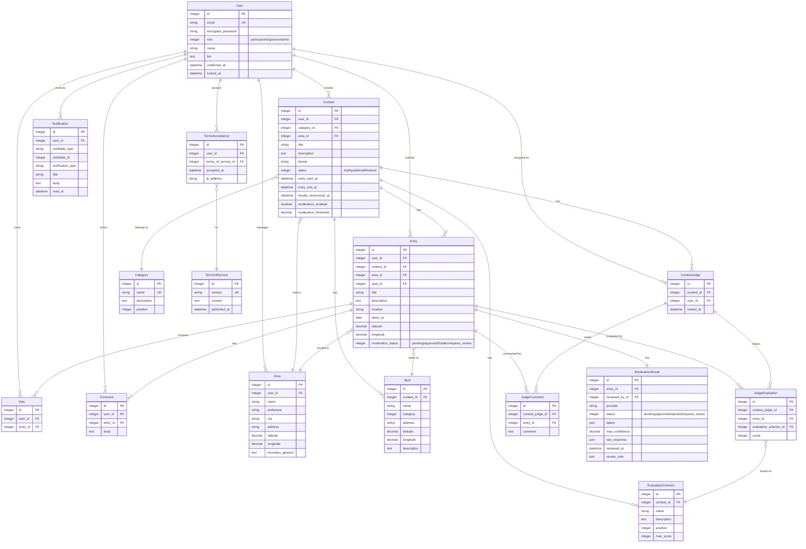
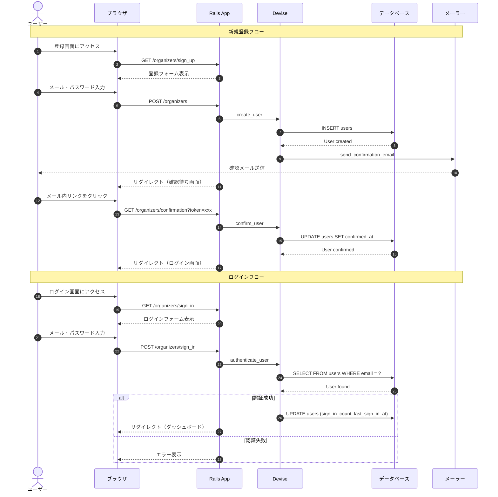
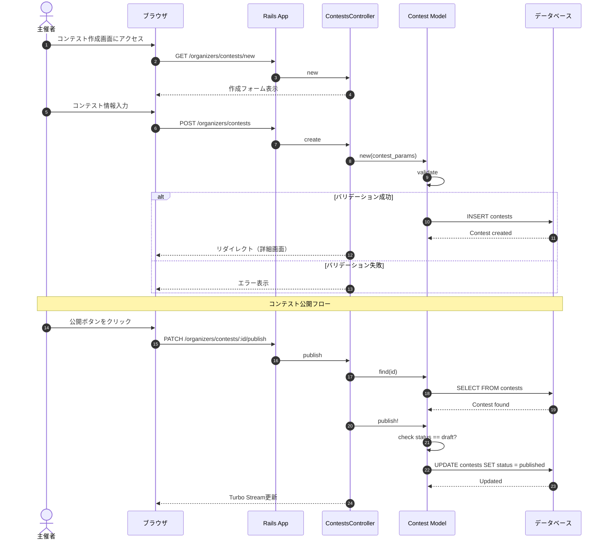
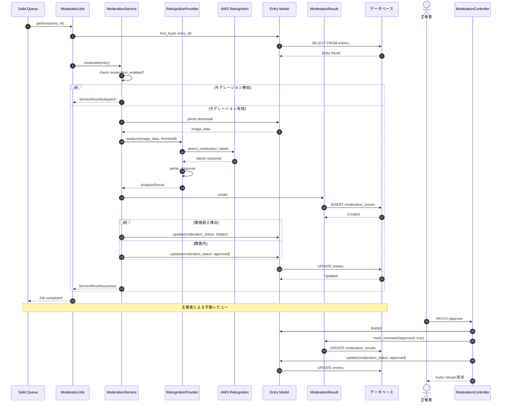
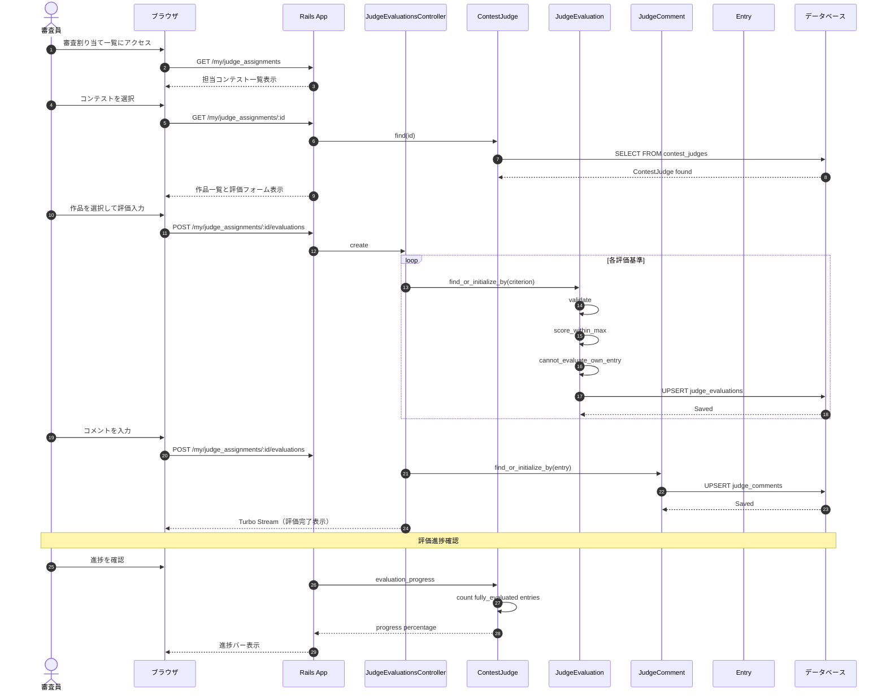
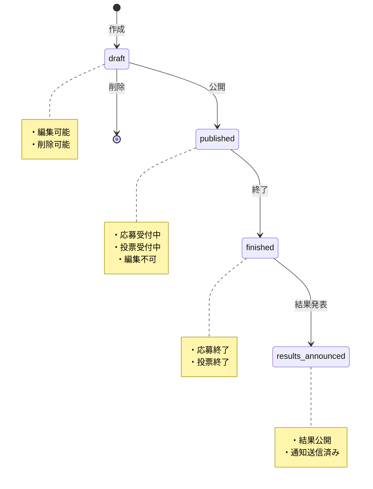
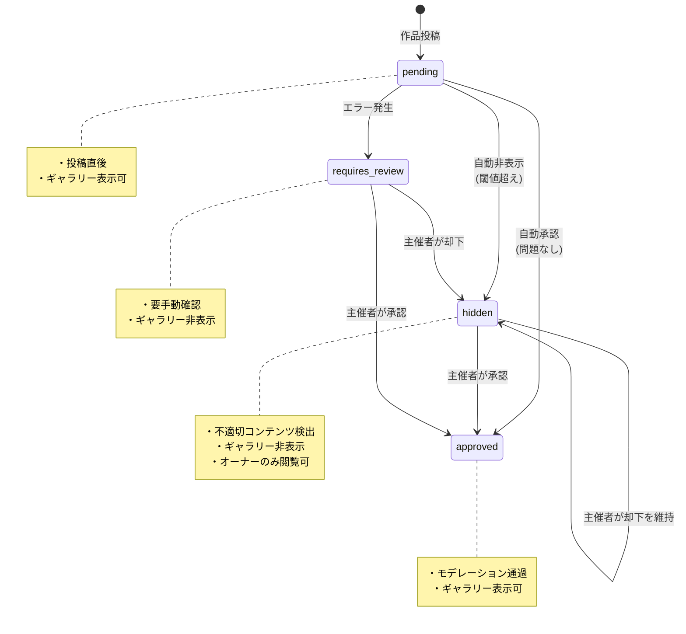

# システム設計図

本ドキュメントでは、Local Photo Contest システムの設計図を Mermaid 形式で提供します。

---

## 目次

1. [ユースケース図](#ユースケース図)
2. [ER図（エンティティ関連図）](#er図エンティティ関連図)
3. [シーケンス図](#シーケンス図)
   - [ユーザー登録・ログイン](#ユーザー登録ログイン)
   - [コンテスト作成](#コンテスト作成)
   - [作品応募](#作品応募)
   - [コンテンツモデレーション](#コンテンツモデレーション)
   - [投票](#投票)
   - [審査員評価](#審査員評価)
   - [結果発表](#結果発表)

---

## ユースケース図

```mermaid
flowchart TB
    subgraph Actors
        P((参加者<br/>Participant))
        O((主催者<br/>Organizer))
        J((審査員<br/>Judge))
        S((システム<br/>System))
    end

    subgraph "参加者のユースケース"
        UC1[コンテスト一覧を閲覧]
        UC2[コンテスト詳細を閲覧]
        UC3[作品を応募]
        UC4[自分の作品を編集/削除]
        UC5[他の作品に投票]
        UC6[作品にコメント]
        UC7[ギャラリーを閲覧]
        UC8[結果を確認]
        UC9[通知を確認]
        UC10[プロフィールを編集]
    end

    subgraph "主催者のユースケース"
        UC11[コンテストを作成]
        UC12[コンテストを編集]
        UC13[コンテストを公開]
        UC14[コンテストを終了]
        UC15[結果を発表]
        UC16[エリアを管理]
        UC17[スポットを管理]
        UC18[審査員を招待]
        UC19[評価基準を設定]
        UC20[応募作品を管理]
        UC21[モデレーション結果を確認]
        UC22[作品を承認/却下]
    end

    subgraph "審査員のユースケース"
        UC23[担当コンテストを確認]
        UC24[作品を評価]
        UC25[審査コメントを記入]
    end

    subgraph "システムのユースケース"
        UC26[画像をモデレート]
        UC27[通知を送信]
        UC28[ランキングを計算]
    end

    P --> UC1
    P --> UC2
    P --> UC3
    P --> UC4
    P --> UC5
    P --> UC6
    P --> UC7
    P --> UC8
    P --> UC9
    P --> UC10

    O --> UC11
    O --> UC12
    O --> UC13
    O --> UC14
    O --> UC15
    O --> UC16
    O --> UC17
    O --> UC18
    O --> UC19
    O --> UC20
    O --> UC21
    O --> UC22

    J --> UC23
    J --> UC24
    J --> UC25

    S --> UC26
    S --> UC27
    S --> UC28

    UC3 -.->|トリガー| UC26
    UC15 -.->|トリガー| UC27
    UC5 -.->|トリガー| UC28
```



### アクター別ユースケース一覧

| アクター | ユースケース |
|---------|-------------|
| 参加者 | コンテスト閲覧、作品応募、投票、コメント、通知確認 |
| 主催者 | コンテスト管理、エリア/スポット管理、審査員招待、モデレーション |
| 審査員 | 作品評価、審査コメント記入 |
| システム | 画像モデレーション、通知送信、ランキング計算 |

---

## ER図（エンティティ関連図）



---

## シーケンス図

### ユーザー登録・ログイン



### コンテスト作成



### 作品応募

```mermaid
sequenceDiagram
    autonumber
    actor Participant as 参加者
    participant Browser as ブラウザ
    participant Rails as Rails App
    participant Controller as EntriesController
    participant Model as Entry Model
    participant Storage as Active Storage
    participant DB as データベース
    participant Queue as Solid Queue
    participant Job as ModerationJob

    Participant->>Browser: 応募画面にアクセス
    Browser->>Rails: GET /contests/:id/entries/new
    Rails->>Controller: new
    Controller-->>Browser: 応募フォーム表示

    Participant->>Browser: 写真・情報を入力
    Browser->>Rails: POST /contests/:id/entries
    Rails->>Controller: create
    Controller->>Model: new(entry_params)

    Model->>Model: validate
    Model->>Model: contest_accepting_entries?
    Model->>Model: photo_content_type
    Model->>Model: photo_size

    alt バリデーション成功
        Model->>DB: INSERT entries
        DB-->>Model: Entry created
        Model->>Storage: attach photo
        Storage-->>Model: Photo attached
        Model->>Model: after_create_commit
        Model->>Queue: enqueue ModerationJob
        Queue-->>Model: Job queued
        Controller-->>Browser: リダイレクト（詳細画面）
    else バリデーション失敗
        Controller-->>Browser: エラー表示
    end

    Note over Queue,Job: 非同期モデレーション処理
    Queue->>Job: perform(entry_id)
    Job->>Job: Moderation::ModerationServiceを呼び出し
```

### コンテンツモデレーション



### 投票

```mermaid
sequenceDiagram
    autonumber
    actor Participant as 参加者
    participant Browser as ブラウザ
    participant Rails as Rails App
    participant Controller as VotesController
    participant Vote as Vote Model
    participant Entry as Entry Model
    participant DB as データベース

    Participant->>Browser: 作品詳細画面を閲覧
    Browser->>Rails: GET /entries/:id
    Rails-->>Browser: 作品詳細表示（投票ボタンあり）

    Participant->>Browser: 投票ボタンをクリック
    Browser->>Rails: POST /entries/:id/vote
    Rails->>Controller: create

    Controller->>Vote: new(user: current_user, entry: entry)
    Vote->>Vote: validate
    Vote->>Vote: cannot_vote_own_entry
    Vote->>Vote: contest_accepting_votes

    alt バリデーション成功
        Vote->>DB: INSERT votes
        DB-->>Vote: Vote created
        Controller-->>Browser: Turbo Stream（投票数更新）
    else 自分の作品
        Controller-->>Browser: エラー「自分の作品には投票できません」
    else 重複投票
        Controller-->>Browser: エラー「既に投票済みです」
    end

    Note over Participant,DB: 投票取り消し
    Participant->>Browser: 投票取り消しボタンをクリック
    Browser->>Rails: DELETE /entries/:id/vote
    Rails->>Controller: destroy
    Controller->>Vote: find_by(user: current_user, entry: entry)
    Vote->>DB: DELETE FROM votes
    DB-->>Vote: Vote deleted
    Controller-->>Browser: Turbo Stream（投票数更新）
```

### 審査員評価



### 結果発表

```mermaid
sequenceDiagram
    autonumber
    actor Organizer as 主催者
    participant Browser as ブラウザ
    participant Rails as Rails App
    participant Controller as ContestsController
    participant Contest as Contest Model
    participant Entry as Entry Model
    participant Notification as Notification Model
    participant DB as データベース

    Organizer->>Browser: コンテスト管理画面にアクセス
    Browser->>Rails: GET /organizers/contests/:id
    Rails-->>Browser: コンテスト詳細（結果発表ボタンあり）

    Organizer->>Browser: 結果発表ボタンをクリック
    Browser->>Rails: PATCH /organizers/contests/:id/announce_results
    Rails->>Controller: announce_results

    Controller->>Contest: find(id)
    Contest->>DB: SELECT FROM contests
    DB-->>Contest: Contest found

    Controller->>Contest: announce_results!
    Contest->>Contest: check finished?
    Contest->>Contest: check not results_announced?

    Contest->>DB: UPDATE contests SET results_announced_at
    DB-->>Contest: Updated

    Contest->>Contest: send_results_notifications
    Contest->>Entry: ranked_entries
    Entry->>DB: SELECT with vote counts
    DB-->>Entry: Ranked entries

    loop 各参加者
        Contest->>Notification: create_results_announced!
        Notification->>DB: INSERT notifications
        DB-->>Notification: Created
    end

    loop Top 3 入賞者
        Contest->>Notification: create_entry_ranked!
        Notification->>DB: INSERT notifications
        DB-->>Notification: Created
    end

    Controller-->>Browser: Turbo Stream（結果発表完了）

    Note over Organizer,DB: 参加者による結果確認
    actor Participant as 参加者

    Participant->>Browser: 結果ページにアクセス
    Browser->>Rails: GET /contests/:id/results
    Rails->>Contest: ranked_entries
    Rails->>Contest: judge_ranked_entries
    Rails-->>Browser: ランキング表示

    Participant->>Browser: 通知を確認
    Browser->>Rails: GET /my/notifications
    Rails->>Notification: where(user: current_user)
    Notification->>DB: SELECT FROM notifications
    DB-->>Notification: Notifications found
    Rails-->>Browser: 通知一覧表示
```

---

## 補足：状態遷移図

### コンテストの状態遷移



### 作品のモデレーション状態遷移



---

## ファイル構成との対応

| 図 | 関連ファイル |
|----|-------------|
| ユースケース図 | `config/routes.rb`, 各Controller |
| ER図 | `db/schema.rb`, `app/models/*.rb` |
| ユーザー登録 | `app/controllers/organizers/registrations_controller.rb` |
| コンテスト作成 | `app/controllers/organizers/contests_controller.rb` |
| 作品応募 | `app/controllers/entries_controller.rb` |
| モデレーション | `app/jobs/moderation_job.rb`, `app/services/moderation/` |
| 投票 | `app/controllers/votes_controller.rb` |
| 審査員評価 | `app/controllers/my/judge_evaluations_controller.rb` |
| 結果発表 | `app/models/contest.rb#announce_results!` |

---

*このドキュメントは Local Photo Contest v1.0 に基づいています。*
